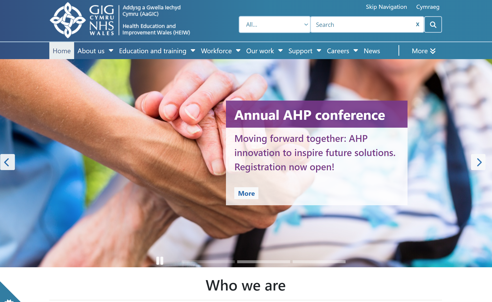
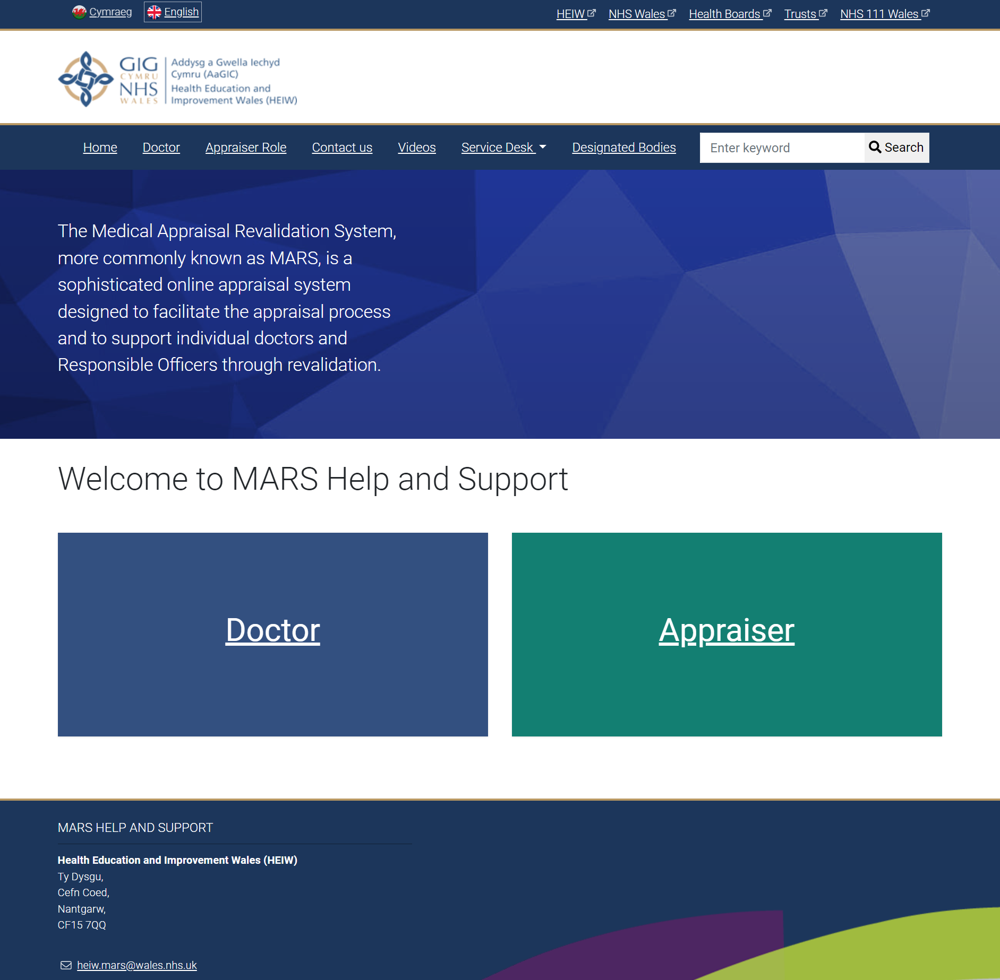
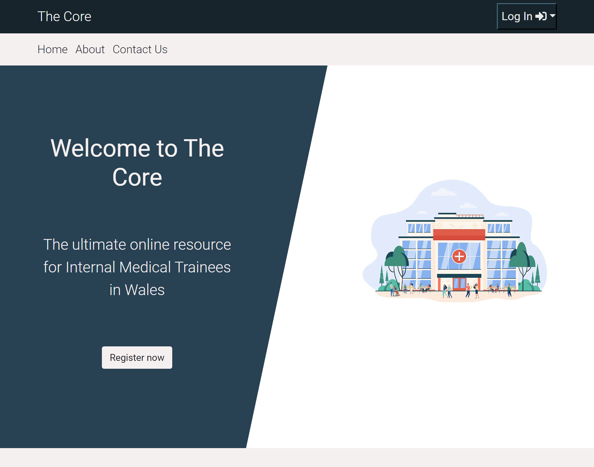
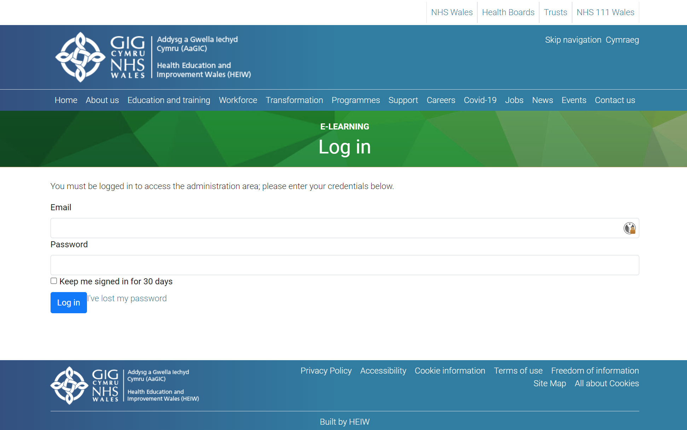
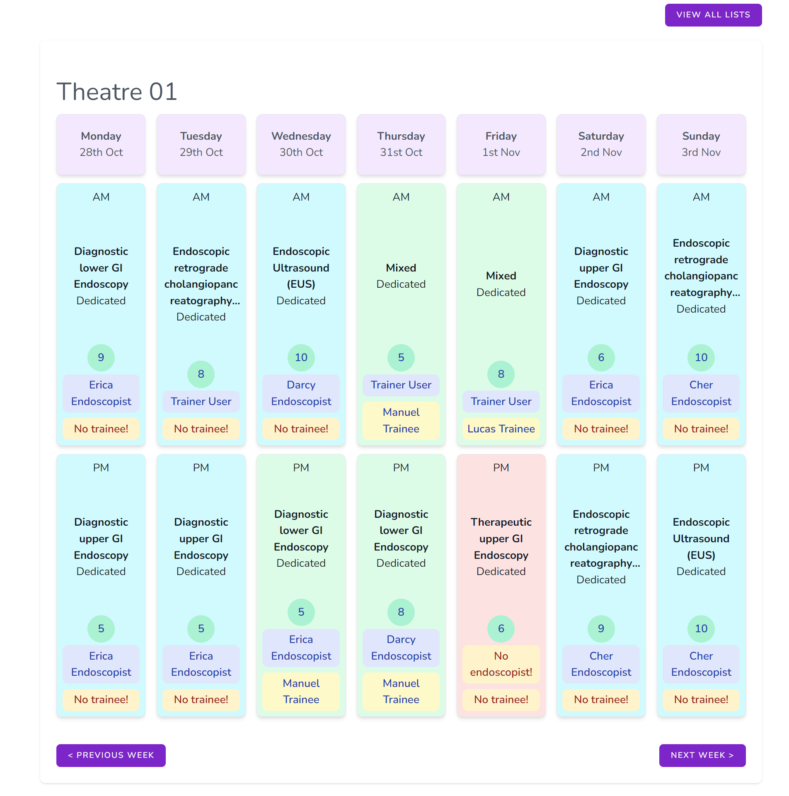
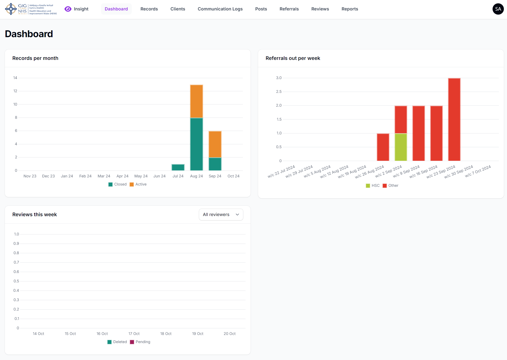

Photo
by [Art Institute of Chicago](https://unsplash.com/@halacious?utm_content=creditCopyText&utm_medium=referral&utm_source=unsplash)
on [Unsplash](https://unsplash.com/photos/a-blueprint-of-a-building-with-a-clock-tower-sAlWjm2huck?utm_content=creditCopyText&utm_medium=referral&utm_source=unsplash)


Since 2020, I have been involved in many projects. This portfolio gives the high level highlights for each of the major
projects I have been involved in.


## Health Education and Improvement Wales (HEIW)

Website: <a href="https://heiw.nhs.wales" alt="heiw.nhs.wales" target="_blank">heiw.nhs.wales</a>

I started working at HEIW in June 2020, just as the first Covid-19 pandemic lockdown started. My first project was to
migrate three public, legacy CMS, to one new Mura CMS. I migrated over one thousand pages of content, updated and
improved. Accurately creating one bilingual and accessible website.

Working closely with the communications team and under the supervision and guidance of my line manager.

All Health Education and Improvement Wales (HEIW) websites and web applications must be bilingual (English and Welsh)
and compliant to Web Content Accessibility Guidelines (WCAG) 2.1 AA accessibility standard. This is a legal requirement
from the Welsh Assembly Government (WAG).

Technology: Mura CMS, HTML and CSS (Bootstrap)

## MARS help and support

Website: <a href="https://marshelp.heiw.wales/" alt="marshelp.heiw.wales" target="_blank">marshelp.heiw.wales</a>

My first Silverstripe CMS website is a companion site, which provides help and support to the main Medical Appraisal
Revalidation System (MARS) applications (https://gp.marswales.org and https://medical.marswales.org).

I was responsible for building a new site, based on an existing Silverstipe CMS site. I had to create
new page layouts and update the theme. The content for the help pages was added by the HEIW revalidation support unit (
RSU), using the CMS page templates I built. All static content had to be translated and be fully compliant with
bilingual and accessible legislation.

Technology: Silverstripe CMS, PHP, CSS (Bootstrap/LESS), Javascript (jQuery), MySQL and Nginx.

## The Core

Website: <a href="https://thecore.wales/" alt="thecore.wales" target="_blank">thecore.wales</a>

The Core was my second Silverstripe CMS project. I was responsible for upgrading an existing Silverstripe CMS site to
the latest version. This also included upgrading the code, in controllers and models, from PHP 7.0 to PHP 7.4, which was
the latest version at that time. Once the upgrade was complete, I redesigned the home and about pages, in line with the
product owners requirements. Finally, the trainee clinic booking system was updated by adding additional features such
as the ability for the medical trainee to sign up for a clinic and make notes, which can be later exported to word.

I was able to work for large parts of the project with minimal supervision, normally weekly reviews of how the new site
was looking. Monthly demonstrations were given to the product owner.

The majority of the 100 pages are author-generated content withing the CMS. The clinic booking system was used to
provide evidence of attending training sessions. The content is available to registered medical trainees.

Technology: Silverstripe CMS, PHP, CSS (Bootstrap/LESS), JavaScript (jQuery), MySQL and Nginx.

## E-Learning

Website: <a href="https://elearning.heiw.wales/admin" alt="elearning.heiw.wales/admin" target="_blank">
elearning.heiw.wales/admin</a>

The E-Learning site was my third Silverstripe CMS project. HEIW had e-learning content that required JavaScript to run,
this would not work on the main website as JavaScript was restricted. I was tasked with building a similar-looking
website, to our main website, though it was not an exact copy and should not deceive visitors. Specific endpoints can be
shared by their URL for e-learning modules. The menu will take the user to the main website. This site still has to be
legally compliant by being bilingual and accessible.

My design has become the template for fellow developers on many other Silverstripe CMS sites.

Technology: Silverstripe CMS, PHP, CSS (Bootstrap/LESS), JavaScript (jQuery), PHPUnit, MySQL and Nginx.

## The MEET tool

In October 2021, I successfully applied for an online application developer position at HEIW.

The MEET tool was my first opportunity to build a new Laravel app, as a lead developer. I could follow the full software
product life cycle. I started the project after the HEIW board had approved it and took it to completion.

I was responsible for converting the product owners requirements into actionable stories. Approximately 90% of
the project was built by myself. For part of the project I supervised a junior developer, who helped to build 10%.
He focused on the help section, accessibility and translation requirements. This allowed me to focus on the more complex
requirements of the app.

Over 1,000 PHPUnit feature tests where written; this proved the new app was always working as expected. Test-driven
development (TDD) to build some features, such as the algorithm with the ability to automatically allocate available
trainee endoscopist to available training lists.

Technology: Tailwind CSS, Alpine.js, Laravel, Livewire (TALL) stack, PHP, PHPUnit, MySQL, Nginx, Filament admin panel
and Azure App service.

## Insight

The site is only visible internally to HEIW.

Insight is used by the professional support unit (PSU) in HEIW. It is used to track the support of trainee doctors. The
application is critical to help track the support history.

The latest Laravel project was to upgrade an existing Laravel site to the latest version, upgrade PHP and replace an
existing in-house framework with Filament PHP.

After examining the requirements, I calculated the quickest and easiest way forward was to build a new Laravel app and
migrate the database, ensuring there was no loss of data.

Over 300 PHPUnit feature tests where written, during development, to prove the new app was working as expected.

When the new app was live, I was able to add additional features, as requested by the product owner and users.

Technology: Laravel, PHP, MySQL, PHPUnit, Filament PHP, Nginx, JavaScript (Alpine) and Azure App service. 
