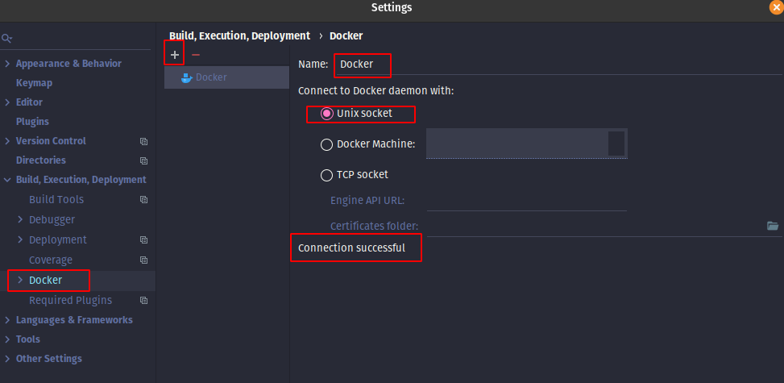
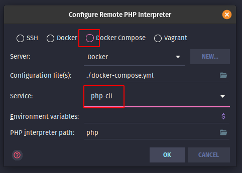
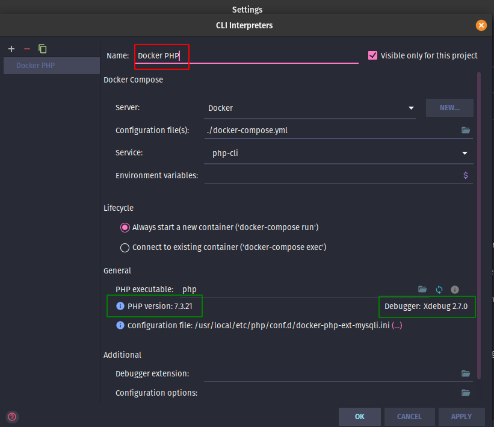
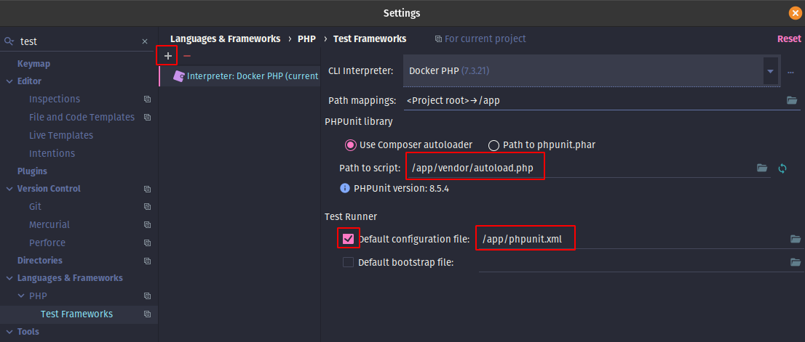
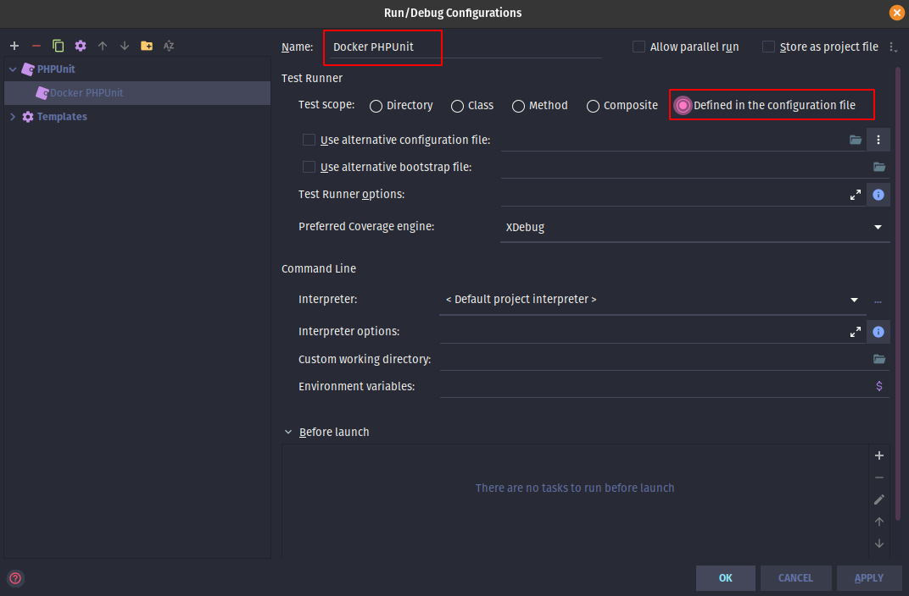
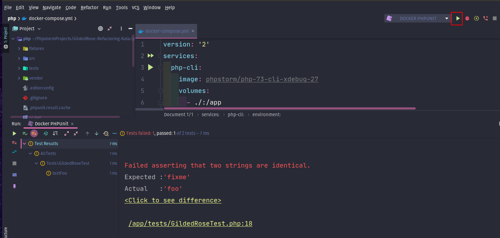
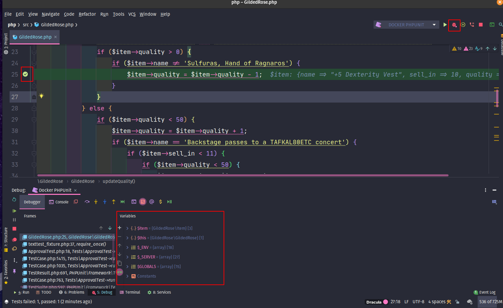

I have recently configured my windows 10 laptop with an additional SSD, so I could experiment with Linux. I have
already [installed Pop!_OS Git, PhpStorm and Docker](/2020/10/05/Pop-OS-new-install/). I haven't installed PHP or
Composer locally. Next I want to learn how to use this new environment. This is what I have found out so far.

## Start with a Project

One of my favorite projects is the Gilded Rose Kata. I can clone that from github as follows:

```shell script
cd ~/PhpstormProjects/
git clone git@github.com:emilybache/GildedRose-Refactoring-Kata.git
cd GildedRose-Refactoring-Kata/php/
```

## Create docker-compose.yml

It is possible to run PHP cli without a docker-compose file, I have found it is easier to set up PhpStorm using this
intermediate step.

PhpStorm has several preconfigured Docker containers, source:

- [Github - JetBrains / phpstorm-docker-images](https://github.com/JetBrains/phpstorm-docker-images)
- [Docker hub - PhpStorm](https://hub.docker.com/u/phpstorm)

They can be used as follows:

### Php 7.3 CLI and XDebug 2.7

`docker-compose.yml`

```yaml
version: '2'
services:
  php-cli:
    image: phpstorm/php-73-cli-xdebug-27
    volumes:
      - ./:/app
    environment:
      # For Linux, replace the line below with your hostname, 
      # which you can obtain by executing `hostname` in Terminal.
      XDEBUG_CONFIG: remote_host=pop-os
    working_dir: "/app"
```

The above will work for Linux, for Windows and MacOS the `XDEBUG_CONFIG:` will need the changed as follows:

### Windows and MacOS

Windows and MacOS replace with `XDEBUG_CONFIG:host.docker.internal`, which will automatically resolve to the internal
address of the host Docker is running on.

```yaml
environment:
  XDEBUG_CONFIG: remote_host=host.docker.internal
```

### MacOS with local Homebrew php-fpm

If you use a local Homebrew php-fpm installation, port 9000 (which is the default debugging port) may become occupied.
PhpStorm will remain silent on starting listening for incoming connections. If this is the case, in the Settings |
Languages & Frameworks | PHP | Debug, set the Debug port to 9001, and use the following configuration line instead.

```yaml
environment:
  XDEBUG_CONFIG: remote_host=host.docker.internal, remote_port=9001
```

### Apache, PHP 7.3, XDebug 2.7 and MySQL

For information this is the LAMP version (based on the phpstorm-workshop).

`docker-compose.yml`

```yaml
version: '2'
services:
  debug:
    image: phpstorm/php-73-apache-xdebug-27
    ports:
      - "8081:80"
    volumes:
      - ./:/var/www/html
    environment:
      #For Windows and macOS, replace the line below with `host.docker.internal`,
      # which will automatically resolve to the internal address of the host
      # Docker is running on.
      #For Linux, replace the line below with your hostname, 
      # which you can obtain by executing `hostname` in Terminal.
      XDEBUG_CONFIG: remote_host=pop-os
      #For macOS, if you use a local Homebrew php-fpm installation, port `9000`
      # (which is the default debugging port) may become occupied. PhpStorm will
      # remain silent on starting listening for incoming connections. If this is
      # the case, in the Settings | Languages & Frameworks | PHP | Debug, set the
      # Debug port to 9001, and use the following configuration line instead.

      #XDEBUG_CONFIG: remote_host=host.docker.internal, remote_port=9001
    working_dir: "/var/www/html"

  mysql:
    image: phpstorm/mysql
    ports:
      - "33056:3306"
    volumes:
      - ./data:/var/lib/mysql
```

## Install dependencies using composer

To keep things simple the composer Docker container can be used to install the dependencies.

This is the script recommended on the [docker hub composer](https://hub.docker.com/_/composer) page to avoid filesystem
permissions problems

> By default, Composer runs as root inside the container. This can lead to permission issues on your host filesystem.
> You can work around this by running the container with a different user:

```shell script
docker run --rm --interactive --tty \
  --volume $PWD:/app \
  --user $(id -u):$(id -g) \
  composer install
```

On windows change `$PWD` for the full path to the project (note: forward slash / as separator), remove the line end **
\\** and run the command as one line:

```shell script
docker run --rm -it -v c:/project-path/project-name:/app composer install
```

Alternatively, more complex projects will need specific PHP extensions to be installed, which are not included in the
Composer Docker container. The following method could be used to install Composer, inside the container and install the
dependencies.

1. Access **bash** in the **php-cli** container: `docker-compose run --rm php-cli /bin/bash`
2. Install Composer, by [following the download instructions for Linux](https://getcomposer.org/download/)
3. Still, inside the container, install dependencies: `php composer.phar install`
4. Exit the container `exit`

Note: In Linux, using the second method Composer will create the vendor folder as root!

```shell script
ls -l
```

```text
...
drwxrwxr-x  3 michael michael   4096 Oct  3 19:46 tests
drwxr-xr-x 27 root    root      4096 Sep 30 21:36 vendor
```

The permissions can be changed using chown:

```shell script
sudo chown -R michael:michael ./vendor
ls -l
```

```text
...
drwxr-xr-x 27 michael michael   4096 Sep 30 21:36 vendor
```

### Further information

There is a detailed description
about [running Docker containers as current host user](https://jtreminio.com/blog/running-docker-containers-as-current-host-user/)
.

The official documentation on [Docker run](https://docs.docker.com/engine/reference/run/)
and [docker-compose cli reference](https://docs.docker.com/compose/reference/overview/).

## Configure PhpStorm

Now the project has been cloned from GitHub and the dependencies have been installed. PhpStorm can be setup to use
Docker. Thanks to Gary Hockin's excellent YouTube
video [Running PHPUnit Tests in PhpStorm with Docker](https://www.youtube.com/watch?v=I7aGWO6K3Ho&list=RDCMUCGp4UBwpTNegd_4nCpuBcow)
, the setup process can be easily replicated.

There is a four stage process:

1. Configure PhpStorm to use Docker
2. Configure the remote interpreter
3. Configure PhpUnit
4. Create Test runner

### 1. Configure PhpStorm to use Docker

- Settings (Ctrl + Alt + S)
- Search for Docker
    - Under Build, Execution, Deployment
- Click + to add
- Select Unix socket
    - Confirm connection was successful



### 2. Configure the default CLI interpreter

- Settings (Ctrl + Alt + S)
- Search for CLI interpreter
    - Under Language & Frameworks > PHP
- Click the ellipse button next to CLI Interpreter
- Click +
- Select From Docker, Vagrant...
- Choose **Docker Compose**
- Choose the Service from the drop down list (e.g. php-cli)



- Select OK
- Change the name e.g. Docker PHP



- Apply and OK
- Check the mapping
    - e.g. for a web project \<Project root\>→/var/www/html
    - e.g. for an app project \<Project root\>→/app

### 3. Configure PhpUnit

- Settings (Ctrl + Alt + S)
- Search for Test Frameworks
    - Under Language & Frameworks > PHP
- Click +
- Select PhpUnit from remote interpreter
- Choose the interpreter created above, e.g. Docker PHP
    - Confirm the path mappings, as above \<Project root\>→/app
    - Input the script path based on the mapping inside the container e.g. **/app/vendor/autoload.php**
    - Under Test runner, tick Default configuration script, type in the path, in the docker container. e.g. **
      /app/phpunit.xml**



### 4. Create the test runner

- Click Edit Configuration (next to run test button)
- Click + to add
- Select PHPUnit
- Under Test Runner choose Defined in the configuration file
- Name - e.g. Docker PHPUnit



- Click Play to run all the tests!



## What about configuring xDebug?

Thanks to this setup, xDebug has been automatically configured! It will use the default PHP Interpreter, which was
configured in step 2. A breakpoint can be set in the app or tests can be run with coverage :)



Enjoy the kata!

Edit:  Added details on running commands on MacOS and Windows and small tweaks.
