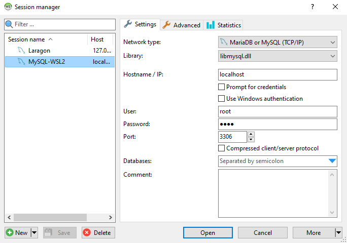
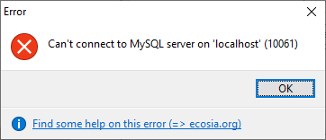
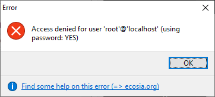

Photo by [Tobias Fischer](https://unsplash.com/@tofi?utm_source=unsplash&utm_medium=referral&utm_content=creditCopyText)
on [Unsplash](https://unsplash.com/s/photos/database?utm_source=unsplash&utm_medium=referral&utm_content=creditCopyText)

How to install and configure MySQL 8.0 on WSL 2 (Ubuntu), this guide
assumes [WSL 2 is already installed with Ubuntu](https://docs.microsoft.com/en-us/windows/wsl/install-win10).

I normally use [Laragon](https://laragon.org/) for my local development, for most sites this works well.However, for
development of Silverstripe CMS projects I regularly have problems exporting my MySQL local MySQL database from Windows
and importing to Linux MySQL. This is due to Silverstripe using Pascal case table names. Normally the Silverstripe CMS,
on the Linux server will rename the lower case table names generated on Windows MySQL, however the Fluent plugin does
not support this feature. I therefore have to manually rename the lower case table names for Fluent to Pascal case. By
using MySQL on WSL 2 I get around this problem. I still get the benefit of Laragon for Apache, PHP, Node, HeidiSQL etc.

## Update WSL 2 Ubuntu

-
Source: [Get started with databases on Windows Subsystem for Linux](https://docs.microsoft.com/en-us/windows/wsl/tutorials/wsl-database)

Open your WSL terminal (ie. Ubuntu).

Fetch the latest updates and upgrade

```sh
sudo apt update && sudo apt upgrade
```

Enter the password you set when you installed Ubuntu WSL.

Wait for the packages to install, there will be a lot of information scrolling up the screen!

## Install MySQL server

Once the packages have updated, install MySQL server:

```sh
sudo apt install mysql-server
```

Wait for the server to install, again there will be a lot of information scrolling up the screen!

## Confirm installation

Installation can be confirmed by checking the version number:

```sh
mysql --version
```

You should see output like:

> mysql Ver 8.0.26-0ubuntu0.20.04.2 for Linux on x86_64 ((Ubuntu))

## Secure the MySQL server

You may also want to run the included security script. This changes some less secure default options for things like
remote root logins and sample users.

First start the MySQL server:

```sh
sudo /etc/init.d/mysql start
```

Then run the security script:

```sh
sudo mysql_secure_installation
```

> Securing the MySQL server deployment.
>
> Connecting to MySQL using a blank password.
>
> VALIDATE PASSWORD COMPONENT can be used to test passwords and improve security. It checks the strength of password and
> allows the users to set only those passwords which are secure enough. Would you like to setup VALIDATE PASSWORD
> component?
>
> Press y|Y for Yes, any other key for No: **n**
>
> Please set the password for root here.
>
> New password: **root**
>
> Re-enter new password:  **root**
>
> By default, a MySQL installation has an anonymous user, allowing anyone to log into MySQL without having to have a
> user account created for them. This is intended only for testing, and to make the installation go a bit smoother. You
> should remove them before moving into a production environment.
>
> Remove anonymous users? (Press y|Y for Yes, any other key for No) : **y**
>
> Success.
>
> Note: Normally, root should only be allowed to connect from
'localhost'. This ensures that someone cannot guess at the root password from the network.
>
> Disallow root login remotely? (Press y|Y for Yes, any other key for No) : **n**
>
> ... skipping.
>
> By default, MySQL comes with a database named 'test' that anyone can access. This is also intended only for testing,
> and should be removed before moving into a production environment.
>
> Remove test database and access to it? (Press y|Y for Yes, any other key for No) : **n**
>
> ... skipping.
>
> Reloading the privilege tables will ensure that all changes made so far will take effect immediately.
>
> Reload privilege tables now? (Press y|Y for Yes, any other key for No) : **y**
>
> Success.
>
> All done!

**Note:** The above is Ok for local development, for a production the server the root user should be secured with a
strong password and no external access allowed.

## Verify MySQL is running

To open the MySQL prompt, enter:

```sh
sudo mysql
```

To view the available databases, in the MySQL prompt, enter:

```sql
SHOW
DATABASES;
```

You should see output like:

> | Database           |
> | :----------------- |
> | information_schema |
> | mysql              |
> | performance_schema |
> | sys                |
>
> 4 rows in set (0.00 sec)

## Allow remote access

Allow the root user to assess the database using basic username and password authentication (no certificate required).

-
Source [SO - Cannot connect to MySQL database (running on WSL2) from Windows Desktop Application “MySQL Workbench”](https://stackoverflow.com/questions/58905555/cannot-connect-to-mysql-database-running-on-wsl2-from-windows-desktop-applicat)

From the MySQL prompt run:

```sql
ALTER
USER 'root'@'localhost' IDENTIFIED WITH mysql_native_password BY 'root';
```

Exit out of the MySQL prompt

```sql
exit
```

## Configure HeidiSQL

HeidiSQL can now be configured to connect to MySQL 8.0 in WSL

- Click **New** and give the connection a new name, e.g. **MySQL-WSL2**
- Library **libmysql.dll**
- Hostname / IP: **localhost**
- User: **root**
- Password: **root**



## Change the default port

MySQL running in Windows (installed by Laragon) and MySQL WSL Ubuntu can not run at the same time using the same port (
default 3306), one will need to be changed to avoid conflicts.

-
source [AskUbuntu - How to change mysql8.0 default port](https://askubuntu.com/questions/1120540/how-to-change-mysql8-0-default-port)

Open your WSL terminal (ie. Ubuntu).

```shell
sudo nano /etc/mysql/my.cnf
```

Add these lines to use post 33061:

```ini
[mysqld]
port = 33061
```

Save (write) the file and exit nano (CTRL+W enter, CTRL+X)

Restart MySQL to load the new config:

```shell
sudo service mysql restart
```

Remember to change the port in HeidiSQL and any .env files.

## Start MySQL automatically when WSL starts

Each time WSL is shutdown MySQL will also stop, when WSL is started MySQL does not automatically start, although it
could be configured to do so!

- source [AskUbuntu - Start MySQL on Startup](https://askubuntu.com/questions/416309/start-mysql-on-startup)

Open your WSL terminal (ie. Ubuntu).

```shell
sudo update-rc.d mysql defaults
```

Now every time WSL is started, MySQL will also start.

## Manually start MySQL

If MySQL is not needed everytime WSL is started, it can be manually started

Open your WSL terminal (ie. Ubuntu).

```shell
sudo service mysql start
```

## Troubleshooting

### Typical errors and possible reasons

This is the error when MySQL is not running:



When you try to connect without using a password (note: using password: **NO**)


When you try to connect using the wrong password (note: using password: **YES**):



### Basic troubleshooting

Basic troubleshooting steps can be performed

- make sure WSL is started
- check the MySQL server is running

- source and more
  information [How to fix common problems with MySQL databases](https://upcloud.com/community/tutorials/fix-common-problems-mysql-databases/)

### Check the server is running

Check that the service is running If your website cannot connect to your database, it is possible the service is simply
not listening. Check your MySQL state, on Ubuntu and Debian systems this can be done with the following command.

Open your WSL terminal (ie. Ubuntu).

```sh
sudo service mysql status
```

When running the stats will be displayed:

> * /usr/bin/mysqladmin Ver 8.0.26-0ubuntu0.20.04.2 for Linux on x86_64 ((Ubuntu))
    > Copyright (c) 2000, 2021, Oracle and/or its affiliates.
>
> Oracle is a registered trademark of Oracle Corporation and/or its
> affiliates. Other names may be trademarks of their respective
> owners.
>
> Server version 8.0.26-0ubuntu0.20.04.2
> Protocol version 10
> Connection Localhost via UNIX socket
> UNIX socket /var/run/mysqld/mysqld.sock
> Uptime:                 2 hours 12 min 21 sec
>
> Threads: 2 Questions: 743 Slow queries: 0 Opens: 598 Flush tables: 3 Open tables: 151  
> Queries per second avg: 0.093

If MySQL is not running it will simply show:

> * MySQL is stopped.

If your service status says something other than ‘running’, try to restart the process using the same service command as
before but with ‘restart’ instead of ‘status’.

```sh
sudo service mysql restart
```

> * Stopping MySQL database server mysqld                                                                         [ OK ]
> * Starting MySQL database server mysqld          
    > su: warning: cannot change directory to /nonexistent: No such file or
    directory                                                                                                                 [ OK ]

To fix the error with **/nonexistent** directory:

-
Source [serverfault.com - MySQL /nonexistent home vs “No directory, logging in with HOME=/”](https://serverfault.com/questions/755763/mysql-nonexistent-home-vs-no-directory-logging-in-with-home/942422)

```sh
sudo service mysql stop
sudo usermod -d /var/lib/mysql/ mysql
sudo service mysql start
```

### Check the MySQL server for errors

To check the error log:

```sh
sudo grep -i error /var/log/mysql/error.log
```

Example output:

> 2021-08-08T16:45:10.239063Z 0 [ERROR] [MY-010257] [Server] Do you already have another mysqld server running on port:
> 33060 ?

This error happened when I tried to set port=33060, the MySQL server failed to restart, which I way I used 33061 😉

### Check the port

-
source: [ServerFault - How to check what port mysql is running on](https://serverfault.com/questions/116100/how-to-check-what-port-mysql-is-running-on)

```shell
mysql -u root -p
```

Enter the root password set earlier (e.g. **root**)

From the `mysql>` prompt:

```sql
SHOW
GLOBAL VARIABLES LIKE 'PORT';
```

The output will show the configured port, e.g.:

> | Database           | Value |
> | :----------------- | :---- |
> | port               | 33061 |
>
> 1 row in set (0.00 sec)

## Stop MySQL and WSL

To close WSL

If you are in the WSL terminal (i.e. Ubuntu).

```shell
exit
```

Open PowerShell and run:

```sh
wsl --shutdown
```
