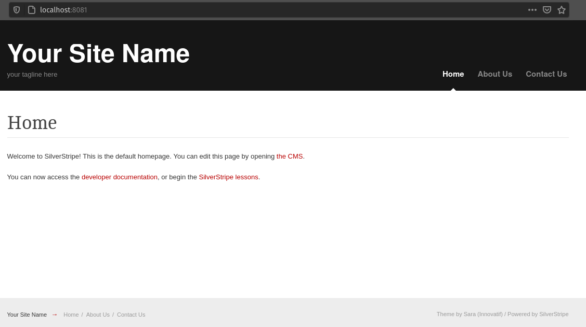
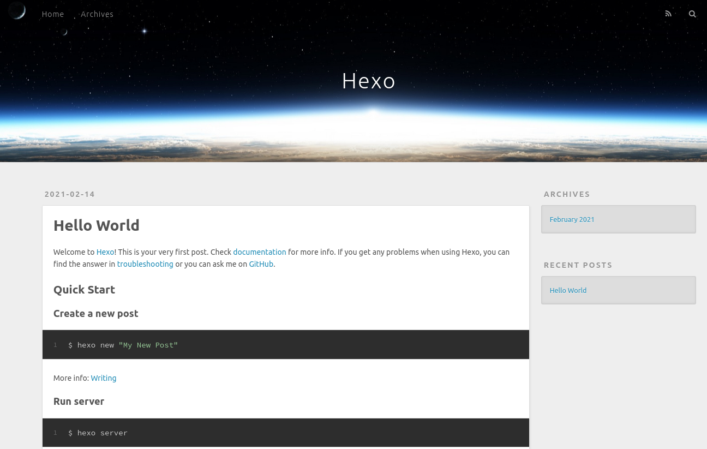

Photo
by [ines mills](https://unsplash.com/@inesmills?utm_source=unsplash&amp;utm_medium=referral&amp;utm_content=creditCopyText")
on [Unsplash](https://unsplash.com/s/photos/shipping-container?utm_source=unsplash&amp;utm_medium=referral&amp;utm_content=creditCopyText)
.

I have been using Docker since I installed [Pop!_OS On my laptop Oct 2020](../../2020/Pop-OS-new-install.md). I
deliberately have not installed PHP, MySQL or Apache on my laptop, which has forced me to learn to use Docker!

The first tutorial I followed was the Docker docs [get started](https://docs.docker.com/get-started/) after I installed
Docker. I found this to be a useful introduction, even though I wanted a PHP environment, the guide still explained the
basics of Docker. I will not cover the basics here, as these are already well covered in the getting started
documentation, there are many youtube channels, some I have watched are:

- [Learn Docker in 12 Minutes 🐳](https://www.youtube.com/watch?v=YFl2mCHdv24) by Jake Wright
- [Docker Tutorial for Beginners - A Full DevOps Course on How to Run Applications in Containers](https://www.youtube.com/watch?v=fqMOX6JJhGo)
  by freeCodeCamp.org
- [Exploring Docker \[1\] - Getting Started](https://www.youtube.com/watch?v=Kyx2PsuwomE) and
- [Exploring Docker \[2\] - Docker Compose With Node &amp; MongoDB](https://www.youtube.com/watch?v=hP77Rua1E0c) by
  Traversy Media.

Brad Traversy has also published an excellent gist:

- [Docker Commands, Help & Tips](https://gist.github.com/bradtraversy/89fad226dc058a41b596d586022a9bd3) with all the
  basic commands!

## So what is the blog about?

What I want to cover are the parts beyond the basics.

- file permissions are one of my biggest problems
- creating a development environment, with the tooling I want at my fingertips.

## File permissions

One of the first hurdles I came across was file permissions. This seems to be particularly on Linux. When the container
is launched, the default user is root. If any files are changed, the file system on the OS will be assigned to root!

For example, if we pull down a repository and want to spin up a docker container for
composer `docker run composer install`, however, the vendor folder will be created as root, along with all the files and
subfolders.

The initial workaround is to run `chown` from the host machine, e.g.

```sh
sudo chown -R michael:michael ./vendor
# or
sudo chown -R $(id -u):$(id -g) ./vendor
```

`$(id -u):$(id -g)` is a way of getting the username and group of the signed-in user. e.g.

```shell
whoami
# michael
id -u
# 1000
id -g
# 1000
id $(whoami)
# uid=1000(michael) gid=1000(michael) groups=1000(michael),...
```

Examples of options are uid:gid, this is normally 1000:1000, or user:group, in my case michael:michael. Further
reading [Find a user's UID or GID in Unix](https://kb.iu.edu/d/adwf). Further details
on [Running Docker Containers as Current Host User](https://jtreminio.com/blog/running-docker-containers-as-current-host-user/)
.

## Composer Docker Image

Composer is the dependency manager for PHP.

- [Docker hub composer images](https://hub.docker.com/_/composer)

### Basic usage

The documentation has the following basic usage:

```shell script
docker run --rm --interactive --tty \
  --volume $PWD:/app \
  composer install
```

The same command can be converted to the shorter syntax. By making it into one line, allowing easier copying and
pasting.

```shell
docker run --rm -it -v $PWD:/app composer install
```

An explanation for the command line:

- `docker run` runs a new instance of a docker image creating a container
- [Clean up (--rm)](https://docs.docker.com/engine/reference/run/#clean-up---rm) automatically clean up the container
  and remove the file system when the container exits, **Note** the **double** minus in `--rm`!
- [--interactive --tty / -i -t / -it](https://docs.docker.com/engine/reference/run/#foreground) For interactive
  processes (like a shell), you must use -i -t together to allocate a tty for the container process. -i -t is
  often written -it
- [--volume / -v $PWD:/app](https://docs.docker.com/engine/reference/run/#volume-shared-filesystems) Bind the host file
  system to the destination, $PWD is the current working directory, /app is the destination directory. On Windows it
  should be the full path name e.g. c:/laragon/www/php-project
- `composer` the image to be run
- `install` is the command to run inside the docker container. This can be any composer command!

For more details please see the [Docker run reference](https://docs.docker.com/engine/reference/run/).

### Fixing filesystem permissions

By default, Composer runs as root inside the container. This can lead to permission issues on your host filesystem. You
can work around this by running the container under the signed-in user:

```shell script
docker run --rm --interactive --tty \
  --volume $PWD:/app \
  --user $(id -u):$(id -g) \
  composer install
```

Again the short, but slightly less readably syntax, can be used to make one line version, with some example commands:

```shell
docker run --rm -it -v $PWD:/app -u $(id -u):$(id -g) composer install
docker run --rm -it -v $PWD:/app -u $(id -u):$(id -g) composer update
docker run --rm -v $PWD:/app -u $(id -u):$(id -g) composer test
docker run --rm -v $PWD:/app -u $(id -u):$(id -g) composer check-cs
docker run --rm -v $PWD:/app -u $(id -u):$(id -g) composer phpstan
```

You may notice, install and update have an interactive terminal -it. The test, check-cs and phpstan do not. Sometimes
Composer asks questions, which need user input, to run tests and lint code this is not required.

The composer config file **composer.json** would contain the scripts for **test**, **check-cs** and **phpstan** e.g.:

**composer.json**

```json
{
  "scripts": {
    "test": "phpunit",
    "check-cs": "ecs check --ansi",
    "phpstan": "phpstan analyse --ansi"
  }
}
```

The command is similar, as explained above, with -u or --user added:

- [--user or -u](https://docs.docker.com/engine/reference/run/#user) Sets the username or UID used and optionally the
  group name or GID for the specified command
- `$(id -u):$(id -g)` is a way of getting the username and group of the signed-in user. e.g.

This is required on Linux. The OS and docker container share the same file system. The docker container will normally
run under user 0, root user, meaning any files written to the shared volume by the container, will be created by the
root user.

### Install composer programmatically

Sometimes Composer will not run the **install** command:

- Composer doesn't have the correct dependencies
- Composer isn't the correct version of PHP.

For example, if I try to install Silverstripe, which needs the PHP **intl** extension:

```sh
git clone git@github.com:Pen-y-Fan/silverstripe-lessons.git
cd silverstripe-lessons
docker run --rm -it -v $PWD:/app -u $(id -u):$(id -g) composer install
```

```text
Your requirements could not be resolved to an installable set of packages.

  Problem 1
    - Installation request for silverstripe/framework 4.5.2 -> satisfiable by 
      silverstripe/framework[4.5.2].
    - silverstripe/framework 4.5.2 requires ext-intl * -> the requested PHP 
      extension intl is missing from your system.
  Problem 2
    - silverstripe/framework 4.5.2 requires ext-intl * -> the requested PHP 
      extension intl is missing from your system.
    - silverstripe/versioned-admin 1.3.1 requires silverstripe/framework ^4.5 -> 
      satisfiable by silverstripe/framework[4.5.2].
    - Installation request for silverstripe/versioned-admin 1.3.1 -> satisfiable 
      by silverstripe/versioned-admin[1.3.1].

  To enable extensions, verify that they are enabled in your .ini files:
    - /usr/local/etc/php/php-cli.ini
    - /usr/local/etc/php/conf.d/docker-php-ext-sodium.ini
    - /usr/local/etc/php/conf.d/docker-php-ext-zip.ini
  You can also run `php --ini` inside terminal to see which files are used by PHP
  in CLI mode.
```

Likewise as more project become php8 only, for example:

```sh
git clone git@github.com:Pen-y-Fan/hello-world-php8.git
cd hello-world-php8
docker run --rm -it -v $PWD:/app -u $(id -u):$(id -g) composer install
```

```text
Fatal error: Uncaught ParseError: syntax error, unexpected ':', expecting ')' in 
/app/tests/HelloWorldTest.php:14

Or

Fatal error: Composer detected issues in your platform: Your Composer dependencies 
require a PHP version ">= 8.0.0". You are running 7.4.14. in 
/app/vendor/composer/platform_check.php on line 24
```

### Possible workarounds

One workaround is to spin-up the version of PHP required, with the extensions and programmatically add Composer.

```shell
#!/bin/sh
DOCKER_HOME=~/tmp
EXPECTED_CHECKSUM="$(wget -q -O - https://composer.github.io/installer.sig)"
php -r "copy('https://getcomposer.org/installer', 'composer-setup.php');"
ACTUAL_CHECKSUM="$(php -r "echo hash_file('sha384', 'composer-setup.php');")"

if [ "$EXPECTED_CHECKSUM" != "$ACTUAL_CHECKSUM" ]
then
    >&2 echo 'ERROR: Invalid installer checksum'
    rm composer-setup.php
    exit 1
fi

php composer-setup.php --quiet --install-dir=/usr/local/bin/ --filename=composer
RESULT=$?
rm composer-setup.php
# smoke test
composer --version
exit $RESULT
```

-
Source: [How do I install Composer programmatically?](https://getcomposer.org/doc/faqs/how-to-install-composer-programmatically.md)

### Troubleshooting Composer

The [Composer Docker hub documentation](https://hub.docker.com/_/composer/) also has the following suggestions:

- **optimal** create your image and install Composer inside it.

**Note:** Docker 17.05 introduced multi-stage builds, simplifying this enormously:

```dockerfile
COPY --from=composer /usr/bin/composer /usr/bin/composer
```

- **alternatively** specify the target platform / extension(s) in your composer.json:

```json
{
  "config": {
    "platform": {
      "php": "MAJOR.MINOR.PATCH",
      "ext-something": "MAJOR.MINOR.PATCH"
    }
  }
}
```

- **discouraged** pass the --ignore-platform-reqs and / or --no-scripts flags to install or update:

```sh
docker run --rm --interactive --tty \
--volume $PWD:/app \
composer install --ignore-platform-reqs --no-scripts
```

## Example Dockerfile

The docker image for the Silverstripe CMS has extensions like **tidy** and **intl** enabled. The Composer image doesn't!
This Dockerfile will copy Composer into the Silverstripe image.

**Dockerfile**

```shell
FROM brettt89/silverstripe-web:7.4-apache
COPY --from=composer /usr/bin/composer /usr/bin/composer
RUN composer self-update --2
```

The **docker-compose.yml** file would something like:

```yaml
version: "3.3"
services:
  silverstripe:
    build: .
    # image: brettt89/silverstripe-web:7.4-apache
    ports:
      - "8081:80"
    volumes:
      - .:/var/www/html
    depends_on:
      - database
    environment:
      - DOCUMENT_ROOT=/var/www/html/public
      - SS_TRUSTED_PROXY_IPS=*
      - SS_ENVIRONMENT_TYPE=dev
      - SS_DATABASE_SERVER=database
      - SS_DATABASE_NAME=SS_mysite
      - SS_DATABASE_USERNAME=root
      - SS_DATABASE_PASSWORD=
      - SS_DEFAULT_ADMIN_USERNAME=admin
      - SS_DEFAULT_ADMIN_PASSWORD=password

  database:
    image: mysql:5.7
    ports:
      - "33060:3306"
    environment:
      - MYSQL_ALLOW_EMPTY_PASSWORD=yes
    volumes:
      - db-data:/var/lib/mysql
volumes:
  db-data:
```

Once the `docker-compose up -d` is run, to spin up the containers. The **silverstripe** container will have Composer
installed. This can be accessed from the terminal within the running container:

```sh
docker-compose exec -it -u $(id -u):$(id -g) silverstripe composer install 
```

## How to create a project from within a Docker container

Sometimes new projects need to be created from the command line, for example using `composer create-project`. This is
before the project folder has been created, therefore **docker-compose.yml** can not be created, in the project folder.
This is a chicken and egg situation. The project can't be started without the tooling, and the tooling can't be spun up
without a project folder.

The solution, with `composer create-project` at least it to create the project folder, spin up the environment, then
create the project in the same folder.

Navigate to your normal project root e.g.:

```shell
cd ~/PhpstormProjects/
mkdir ./silverstripe-demo
cd ./silverstripe-demo
touch ./Dockerfile
touch ./docker-compose.yml
touch ./Makefile
phpstorm .
```

This will:

- create the required directory
- add empty Dockerfile, docker-compose.yml and Makefile
- start PhpStorm

Now PhpStorm is launched its starting to feel like we are working on a project. The Dockerfile from above can be pasted
in the Dockerfile, as can the docker-compose.yml from above in its corresponding file. That leaves us the Makefile.

Makefiles are a simple way to run shell scripts, like batch files in Windows, except there can be several scripts which
can be called by their key. For example:

**Makefile**

```shell
# Set UID to your user ID. To check your user ID run `echo $(id -u)`
UID = 1000

# Usage:
# make up - starts the docker-compose in the same directory in demon (background)
# make down - stops the docker-compose
# make shell - opens a bash terminal inside the Silverstripe container as a standard user
# make shell-root -  opens a bash in Silverstripe container as the root user
# make shell-web -  opens a bash in Silverstripe container as www-data user
# make up-f - start the docker-compose in the foreground (useful for error messages)

up:
	docker-compose up --build --remove-orphans -d
up-f:
	docker-compose up --build --remove-orphans
down:
	docker-compose down --remove-orphans
shell:
	docker-compose exec -u ${shell id -u}:${shell id -g} silverstripe bash
shell-run:
	docker-compose run -rm -u ${shell id -u}:${shell id -g} silverstripe bash
shell-root:
	docker-compose exec -u 0:0 silverstripe bash
shell-web:
	docker-compose exec -u 33:33 silverstripe bash
.PHONY : tests
tests:
	docker-compose exec silverstripe vendor/bin/phpunit
	docker-compose exec silverstripe chown -R ${shell id -u}:${shell id -g} ./
	docker-compose exec silverstripe chown -R 33:33 ./public/
lint:
	docker-compose exec -u ${shell id -u}:${shell id -g} silverstripe vendor/bin/phpcs app/src app/tests
lint-clean:
	docker-compose exec -u ${shell id -u}:${shell id -g} silverstripe vendor/bin/phpcbf app/src app/tests
flush:
	docker-compose exec silverstripe vendor/bin/phpunit app/tests '' flush=1
	docker-compose exec silverstripe chown -R ${shell id -u}:${shell id -g} ./
	docker-compose exec silverstripe chown -R 33:33 ./public/

chown:
	docker-compose exec silverstripe chown -R ${shell id -u}:${shell id -g} ./
	docker-compose exec silverstripe chown -R 33:33 ./public/
```

You can see the Makefile contains the standard docker-compose commands, as you would normally run from the command line.
These work closely with the **docker-compose.yml** file to run the required commands. The make commands can be run
using `make` and the required key.

Normally, the container is up, therefore we can **exec** into the running container. Before we start the project we need
to **run** the container using bash, which will allow access to Composer:

```sh
make shell-run
```

From within the docker container, we now have Composer:

```sh
# I have no name!@b8a8ee52a81b:/var/www/html$ 
composer --version
# Composer version 2.0.9 2021-01-27 16:09:27
```

It would be easier to create the project in this folder, unfortunately, Composer will not allow it, as the folder is not
empty:

```sh
composer create-project silverstripe/installer .
```

```text
// ...
Creating a "silverstripe/installer" project at "./"

                                                     
  [InvalidArgumentException]                         
  Project directory "/var/www/html/." is not empty.  
    
```

We, therefore, need to create the project, in a temp child folder. Then move it to this folder once run:

```sh
composer create-project silverstripe/installer temp
# once installed move the temp folder:
mv ./temp/* ./
ls -l
```

You should see output like this:

```text
-rw-rw-r--  1     1000     1000    128 Feb 14 09:42 Dockerfile
-rw-rw-r--  1     1000     1000   1538 Feb 14 09:34 Makefile
-rw-r--r--  1     1000     1000   3019 Feb 14 12:23 README.md
drwxr-xr-x  4     1000     1000   4096 Feb 14 09:57 app
-rw-r--r--  1     1000     1000   1055 Feb 14 09:57 composer.json
-rw-r--r--  1     1000     1000 163329 Feb 14 09:57 composer.lock
-rw-rw-r--  1     1000     1000    730 Feb 14 09:40 docker-compose.yml
-rw-r--r--  1     1000     1000    876 Feb 14 09:56 phpcs.xml.dist
drwxr-xr-x  4     1000     1000   4096 Feb 14 09:57 public
drwxr-xr-x  2     1000     1000   4096 Feb 14 10:09 temp
drwxr-xr-x  3     1000     1000   4096 Feb 14 09:57 themes
drwxr-xr-x 27     1000     1000   4096 Feb 14 09:57 vendor
-rw-r--r--  1     1000     1000   1002 Feb 14 09:56 web.config
```

If so, it is safe to delete the temp directory and exit the container

```sh
rm -dfr ./temp/
exit
```

Hopefully, the project can be started:

```sh
make up
```

Once up the Silverstripe app will run, in **detached mode**, it can be accessed on <localhost:8081>, however, we see a
browser error:

```sh
[Warning] chmod(): Operation not permitted
GET /dev/build
Line 368 in /var/www/html/vendor/league/flysystem/src/Adapter/Local.php
```

This is a known problem, which can be easily fixed:

```sh
make chown
# docker-compose exec silverstripe chown -R 1000:1000 ./
# docker-compose exec silverstripe chown -R 33:33 ./public/
```

As you can see from the output, the permissions are reset on the root folder (/app) to the id of the signed-in user and
33:33 (www-data:www-data) is given access to /app/public.

Refresh the webpage. The site will build!

```text
Environment Builder
http://localhost:8081/
dev → build
Building database using SilverStripe\ORM\Connect\MySQL 5.7.31
Creating database

Creating database tables
* File
* Table File: created
* Field File.ID: created as int(11) not null auto_increment
...
```

Navigate to <http://localhost:8081/> and the base site will display, or <http://localhost:8081/admin> and sign in to the
CMS using the username and password set in the **docker-compose.yml**:

- SS_DEFAULT_ADMIN_USERNAME=**admin**
- SS_DEFAULT_ADMIN_PASSWORD=**password**



## Node Project

As promised at the start of the blog we will now create a node project, as the methods are the same as the Silverstripe
project I will only explain the differences. We will use this Hexo static content generator as an example. I am running
it now, with Docker.

### Create a new project

We will go through the [Hexo documentation](https://hexo.io/docs/) and convert it to a Docker environment:

### Requirements

Installing Hexo is relatively easy and only requires the following beforehand:

- Node.js (Should be at least Node.js 10.13, recommends 12.0 or higher)
    - We can use Docker
- Git
    - We can use Docker

Install Hexo globally `npm install -g hexo-cli` or per project `npm install hexo` - This can be done inside a node
container.

### Setup

The instructions are:

```sh
hexo init <folder>
cd <folder>
npm install
```

### Docker plan

The setup has the same problem as Silverstripe. You need to install Hexo before you can **init** a project, the
workaround is therefore similar. We need a node image, globally install hexo, init the project then we can cd to the
project. Like Silverstripe we can:

- create the project
- configure Docker to use node
- Add Hexo globally
- init the project in the current directory
- Add Hexo as a project dependency
- reset the permissions

### Create the project

```shell
cd ~/PhpstormProjects/
mkdir ./hexo-demo
cd ./hexo-demo
touch ./docker-compose.yml
touch ./Makefile
phpstorm .
```

### Configure Docker to use node

We can now create the **docker-compose.yml** for Docker and **Makefile** files

**docker-compose.yml**

```yaml
version: '3'
services:
  server:
    image: node:12.18.4-alpine
    command: yarn server
    working_dir: /app
    volumes:
      - .:/app
    ports:
      - "4000:4000"
  generate:
    image: node:12.18.4-alpine
    command: yarn build
    working_dir: /app
    volumes:
      - .:/app
```

**Makefile**

```shell
# Set UID to your user ID. To check your user ID run `echo $(id -u)`
UID = 1000

# Usage:

# make up - starts the docker-compose in the same directory in demon (background)
# make up-f - start the docker-compose in the foreground (useful for error messages)
# make down - stops the docker-compose
# make server - same as make up
# make generate - runs hexo generate as the standard user
# make build - alias to make generate
# make shell - opens a shell terminal in the running node container as a standard user
# make shell-run - starts a new container as a standard user
# make shell-root - opens a shell terminal in the running node container as a root user
# make shell-root-run - starts a new container as a root user 

# make chown - runs chown, as the root user to reset the ownership of all folders to the UID

up:
	docker-compose up --build --remove-orphans -d server
up-f:
	docker-compose up --build --remove-orphans server
down:
	docker-compose down --remove-orphans
server:
	docker-compose up --build --remove-orphans -d server
generate:
	docker-compose run -u ${shell id -u}:${shell id -g} --rm generate
build:
	docker-compose run -u ${shell id -u}:${shell id -g} --rm generate
hexo:
	docker-compose exec -u ${shell id -u}:${shell id -g} server npx hexo new $(new)

shell:
	docker-compose exec -u ${shell id -u}:${shell id -g} server /bin/sh
shell-root:
	docker-compose exec -u 0:0 server /bin/sh
shell-run:
	docker-compose run -u ${shell id -u}:${shell id -g} server /bin/sh
shell-root-run:
	docker-compose run -u 0:0 server /bin/sh

chown:
	docker-compose exec -u 0:0 server chown -R ${shell id -u}:${shell id -g} ./
```

You can see many similarities with the setup, even though they are completely different projects, the methods to start,
stop and access are the same. This gives a consistent environment between projects.

You may be wondering why we are using node 12. As of Feb 2021, if you run Hexo with node 14, you will see an
error: [Regression in Node 14](https://github.com/hexojs/hexo/issues/4257), therefore the **composer-compose.yml** has
been configured to use Node 12 until this is resolved. This is an excellent example of why Docker is so powerful, if
Node 14, the LTS version, was locally installed this would be a problem!

### Add Hexo globally

This is a temporary step, to allow the project to be initialised:

```sh
make shell-root-run
# /app # 
whoami
# root
npm install -g hexo-cli
# ...
# + hexo-cli@4.2.0
# added 65 packages from 339 contributors in 4.852s
```

Keep the node container running and open a new terminal

### init the project in the current directory

With a new terminal open, we can exec in the same running container, except this time as a stand user, reducing the
problem with file permissions.

```shell
docker ps
# CONTAINER ID        IMAGE                ...  NAMES
# e6ce46b15845        node:12.18.4-alpine  ...  hexo-demo_server_run_2746d359d723
# note the name of your server (hexo-demo_server_run_2746d359d723) and replace it below:
docker exec -u ${id -u}:${id -g} -it hexo-demo_server_run_2746d359d723 /bin/sh
# /app # 
whoami
# node
hexo init temp
# INFO  Cloning hexo-starter https://github.com/hexojs/hexo-starter.git
# WARN  git clone failed. Copying data instead
# FATAL {
# ...
```

Ok, so we need git! Good job the other terminal is still open and running as root. Switch terminals:

```sh
# /app 
whoami
# root
apk update && apk add git
# ...
# (6/6) Installing git (2.24.3-r0)
# Executing busybox-1.31.1-r9.trigger
# Executing ca-certificates-20191127-r2.trigger
# OK: 23 MiB in 22 packages
```

Now git has been installed in the running node container we can switch back to the stand node account and try again

```sh
whoami
# node
hexo init temp
```

```text
INFO  Cloning hexo-starter https://github.com/hexojs/hexo-starter.git
INFO  Install dependencies
warning hexo-renderer-stylus > stylus > css-parse > css > urix@0.1.0: Please ...
warning hexo-renderer-stylus > stylus > css-parse > css > source-map-resolve ...
warning hexo-renderer-stylus > stylus > css-parse > css > source-map-resolve ...
warning Your current version of Yarn is out of date. The latest version is ...
INFO  Start blogging with Hexo!
```

Next temp directory can be moved:

```shell
mv ./temp/* .
ls -l
```

```text
total 88
-rw-rw-r--    1 node     node          1316 Feb 14 13:25 Makefile
-rw-r--r--    1 node     node             0 Feb 14 14:19 _config.landscape.yml
-rw-r--r--    1 node     node          2439 Feb 14 14:19 _config.yml
-rw-rw-r--    1 node     node           287 Feb 14 11:32 docker-compose.yml
drwxr-xr-x  166 node     node          4096 Feb 14 14:19 node_modules
-rw-r--r--    1 node     node           615 Feb 14 14:19 package.json
drwxr-xr-x    2 node     node          4096 Feb 14 14:19 scaffolds
drwxr-xr-x    3 node     node          4096 Feb 14 14:19 source
drwxr-xr-x    2 node     node          4096 Feb 14 14:21 temp
drwxr-xr-x    2 node     node          4096 Feb 14 14:19 themes
-rw-r--r--    1 node     node         52871 Feb 14 14:19 yarn.lock
```

```shell
#/app $ 
ls -l temp
#total 0
```

The temp directory can be removed:

```sh
rm -fr ./temp/
ls -l
# check the temp directory has been removed
yarn
```

```text
yarn install v1.22.4
[1/4] Resolving packages...
[2/4] Fetching packages...
info fsevents@2.3.2: The platform "linux" is incompatible with this module.
info "fsevents@2.3.2" is an optional dependency and failed compatibility check. ...
[3/4] Linking dependencies...
[4/4] Building fresh packages...
Done in 0.54s.
```

### Add Hexo as a project dependency

```sh
yarn add hexo
```

```text
yarn add v1.22.4
[1/4] Resolving packages...
[2/4] Fetching packages...
info fsevents@2.3.2: The platform "linux" is incompatible with this module.
info "fsevents@2.3.2" is an optional dependency and failed compatibility check. ...
[3/4] Linking dependencies...
[4/4] Building fresh packages...
success Saved lockfile.
success Saved 1 new dependency.
info Direct dependencies
└─ hexo@5.3.0
info All dependencies
└─ hexo@5.3.0
Done in 0.77s.
```

Exit out of all the terminals.

### Reset the permissions

Open a new terminal:

```sh
docker ps
# There should be no running containers
make chown
# docker-compose exec -u 0:0 server chown -R 1000:1000 ./
ls -l
```

We installed hexo under our account, this was probably is an unnecessary step. All the files and folders are under my
username and group:

```text
total 104
-rw-r--r--   1 michael michael     0 Feb 14 14:19 _config.landscape.yml
-rw-r--r--   1 michael michael  2439 Feb 14 14:19 _config.yml
-rw-r--r--   1 michael michael 19700 Feb 14 14:27 db.json
-rw-rw-r--   1 michael michael   287 Feb 14 14:26 docker-compose.yml
-rw-rw-r--   1 michael michael  1316 Feb 14 13:25 Makefile
drwxr-xr-x 171 michael michael  4096 Feb 14 14:23 node_modules
-rw-r--r--   1 michael michael   619 Feb 14 14:27 package.json
drwxr-xr-x   2 michael michael  4096 Feb 14 14:19 scaffolds
drwxr-xr-x   3 michael michael  4096 Feb 14 14:19 source
drwxr-xr-x   2 michael michael  4096 Feb 14 14:19 themes
-rw-r--r--   1 michael michael 52871 Feb 14 14:23 yarn.lock
```

We can start the website

```shell
make up
```

Open the browser to <localhost:4000>. The Hexo default page will open showing a Hello World blog post.



## Summary

Docker is a powerful development environment. By using the right image, extending them as required, they give us the
required tools to do our job.

File permissions are the bain of Docker on Linux. Once we know how to run the containers, under the correct accounts and
how to change the file and folder permissions, this problem is quickly overcome.

Using Dockerfile with **docker-compose.yml** and **Makefile**. The project environment becomes much easy to work with.

Edit: Replaced ${UID}:${UID} with ${shell id -u}:${shell id -g}
