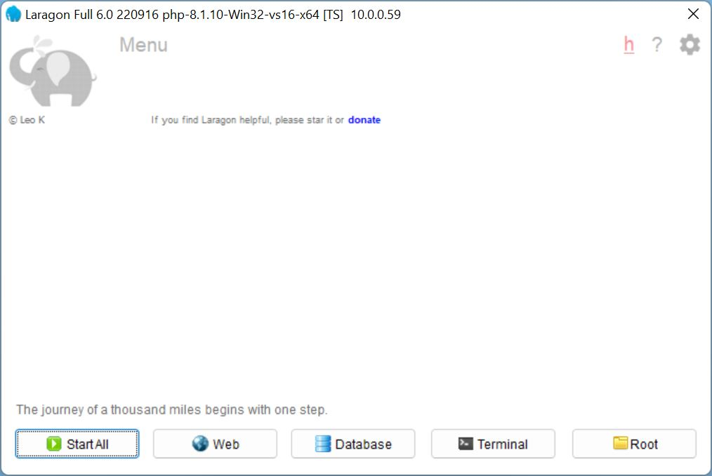
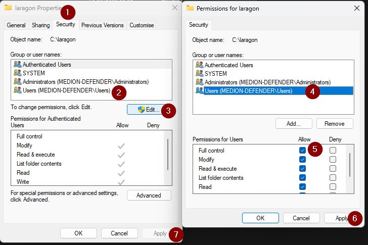
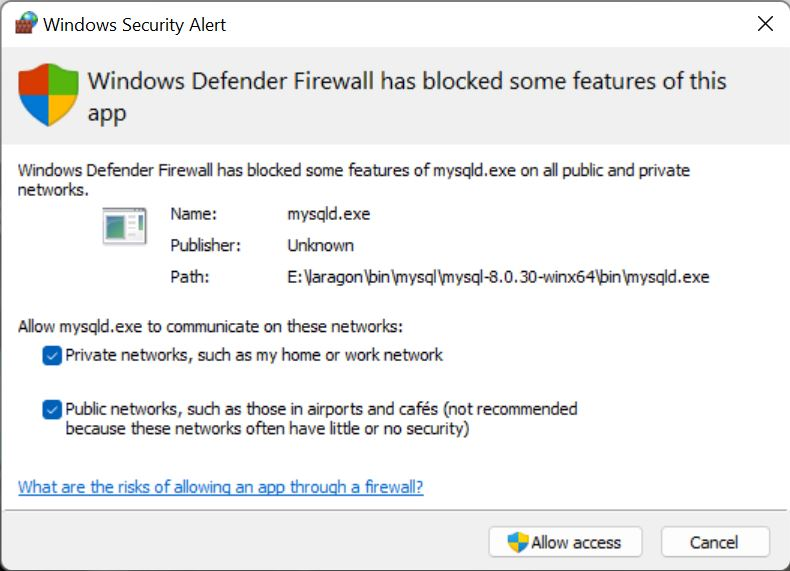
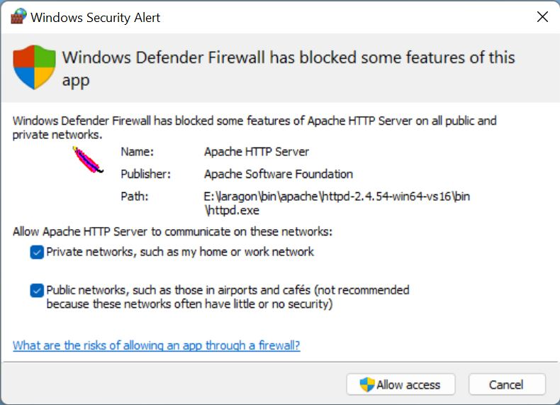
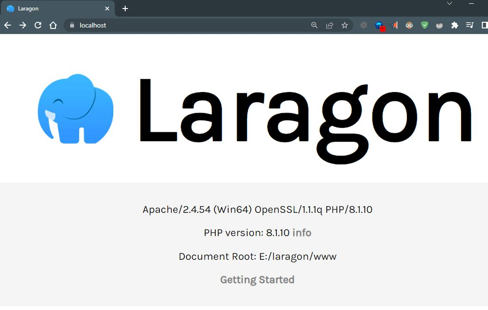

Photo
by [SpaceX](https://unsplash.com/@spacex?utm_source=unsplash&utm_medium=referral&utm_content=creditCopyText)
on [Unsplash](https://unsplash.com/s/photos/Rocket%20launch?utm_source=unsplash&utm_medium=referral&utm_content=creditCopyText)


This is part 2 on how to set up and install Laragon.

Now Laragon is installed it needs permission to run and access through the Windows firewall


## First launch

After the restart, Laragon will automatically open, if you selected that option, otherwise press the Windows key, start
typing **laragon**, and press Enter as soon as Laragon is the top option.

### File permissions

Laragon needs to create files, and run executable programs, such as Apache and MySQL, I recommend you run Laragon using
your standard user account, rather than using "run as admin", or being prompted for elevated privileges every time you
open Laragon. Your standard user account should have permission to run Laragon.

Open Windows file explorer (tip: hold the Windows key and press e), navigate to the drive you installed Laragon,
e.g. **(C:)**, right-click the **laragon** folder and click **properties**.

1. Select the **Security** tab.
2. Under **Group or user names** check either Authenticated Users or Users have at least Modify permission
3. If they don't have at least **Modify** permission: click the **Edit** button (allow elevated privileges/enter your
   admin password)
4. Select **Users**
5. Click **Allow** next to Full control
6. **Apply**, **OK**
7. **Apply**, **OK**

This will give your standard user account permission to run Laragon without needing to "run as admin" all the time.

### Allow firewall access

Switch back to **Laragon**.

Press the **Start All** button

The first time you start Laragon, the Windows defender firewall will prompt you to Allow access.

#### Allow MySQL

Select both checkboxes and click **Allow Access**, you will need to allow elevated privileges or need to enter an
administrator account.

#### Allow Apache

Also, allow Apache. Select both checkboxes and click **Allow Access**, you will need to allow elevated privileges or
enter an administrator account.

In the future you may enable NGINX or Redis, they will also need permission.

No data is being sent out from your computer, they need access to your network, this is the localhost or 127.0.0.1 
loopback address.

## Web

Switch back to **Laragon**, which should have Apache and MySQL started, and press the **Web** button.

")

Your default web browser will launch and the Laragon welcome page will display.

That's the basics done! New projects can be created, and you are good to go! 🎉
