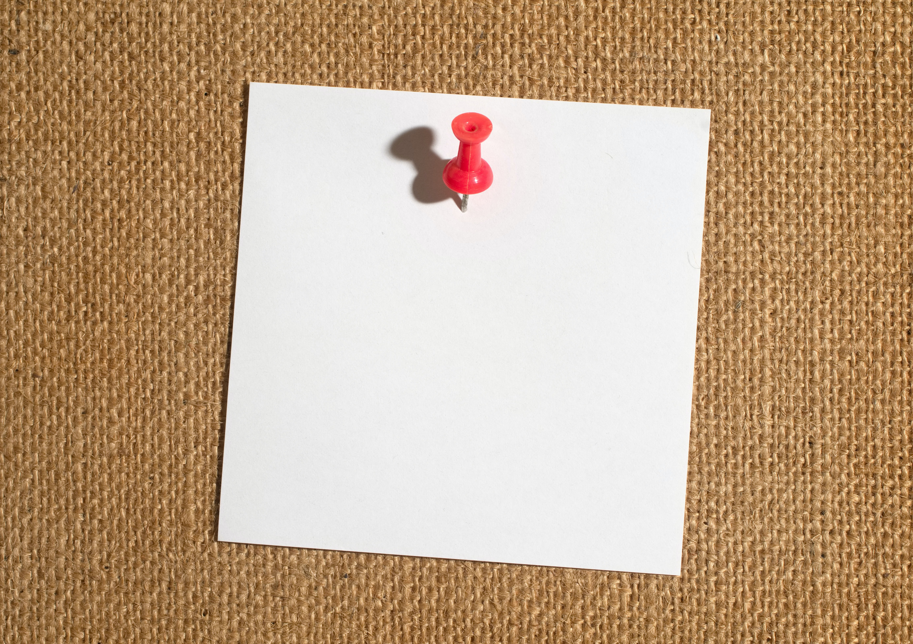
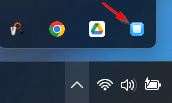
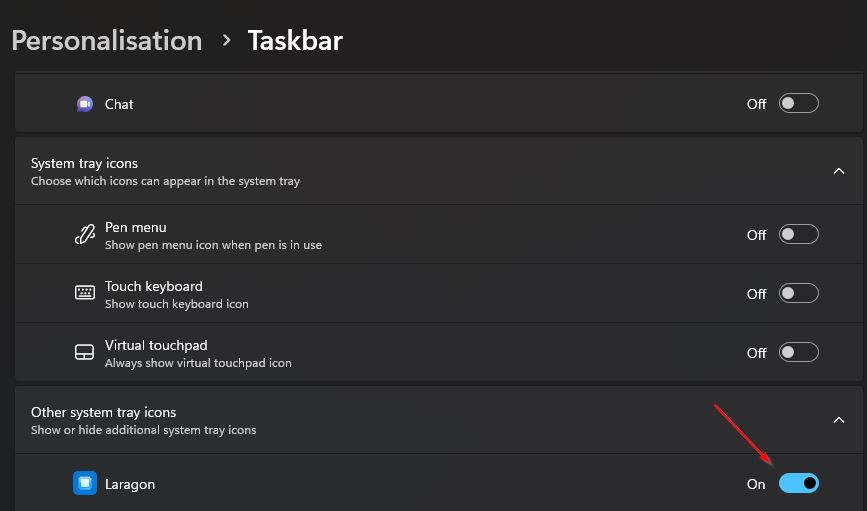
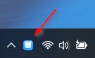
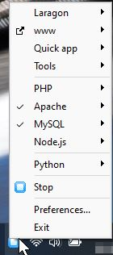
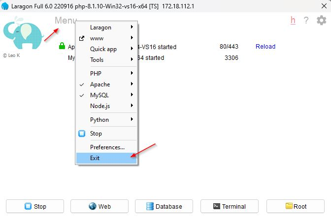

Photo
by [Immo Wegmann](https://unsplash.com/@macroman?utm_source=unsplash&utm_medium=referral&utm_content=creditCopyText)
on [Unsplash](https://unsplash.com/s/photos/pin?utm_source=unsplash&utm_medium=referral&utm_content=creditCopyText)


This is part 3 on how to set up and install Laragon.

Laragon is designed to be portable, meaning it can be opened many times. Keeping the Laragon icon visible in the system
tray, when minimised is helpful. In particular, it will avoid opening a new instance when one is already running. It
also allows the icon to be right-clicked to access the Laragon menu.


## Windows 11 other system tray icon

The default location for the Laragon tray icon is in the "other system tray icons"

The problem is Laragon can get lost in the other icons, leading to it being launched again, which is allowed as Laragon
is a portable application.

This results in two open Laragon's, if the original one is started and when the second one is stated everything will
appear normal, when one is stopped and the other is running, this can lead to confusion.

## Show other system tray icons

The fix is to pin Laragon to the main icon tray.

Right-click an empty area on the taskbar and click **Taskbar settings** (or press the Windows key and type taskbar,
press enter when **Taskbar settings** are the best match).

Expand **Other system tray icons**, scroll down to Laragon and toggle **On**.

## Laragon main system tray icon

Laragon is now in the main system tray icons set.

## Minimising Laragon

Laragon doesn't have the normal three icons in the top right, it only has the X. This will minimise Laragon to the tray.
Clicking the **X** will only close the main window, it will not close Laragon. Laragon will continue to run in the
background and is available from the system tray icon.

To restore the Laragon app click the icon.

Alternatively right-click the icon to see the Laragon menu.

## How to exit Laragon

Laragon can be stopped and exited in two ways:

Click **Menu** and select **Exit** .

Or right-click the system tray icon and select **Exit**.

## Troubleshooting

### Laragon has two icons

Don't panic! This is Laragon's expected behaviour, due to it having a portable version. It's been launched twice.

If Laragon is started click **Stop**, then click the **Menu** and select **Exit**.

When only one is showing in the taskbar click **Stop**, wait then click **Start all**.
