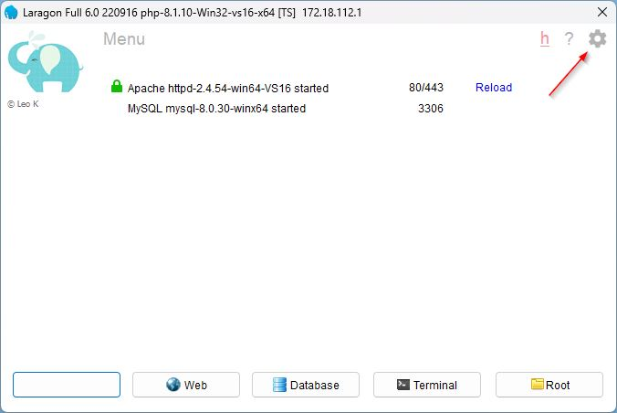
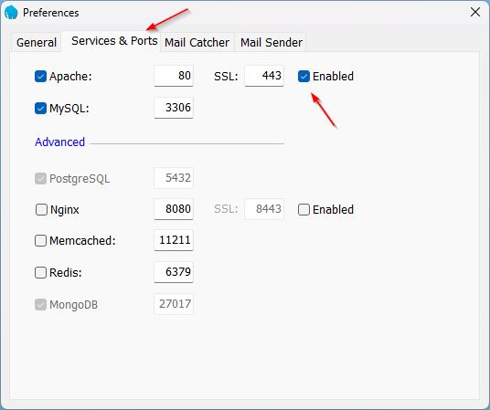
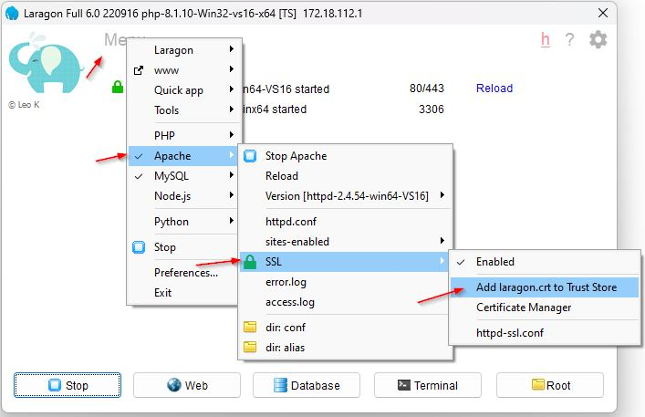
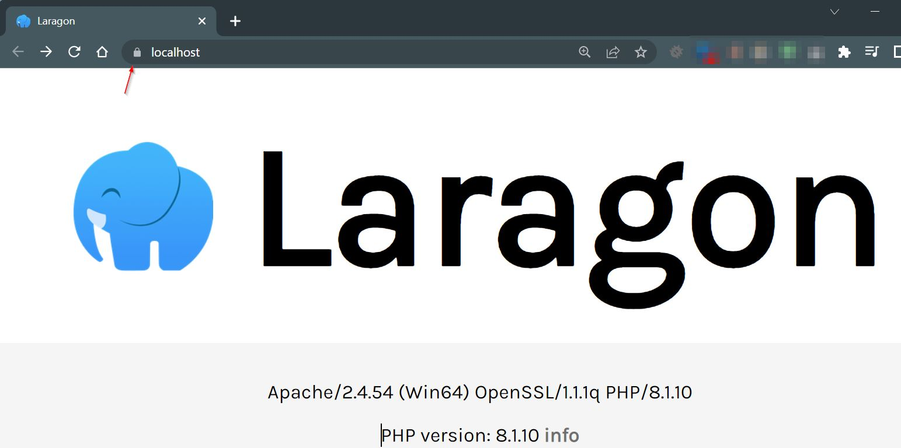
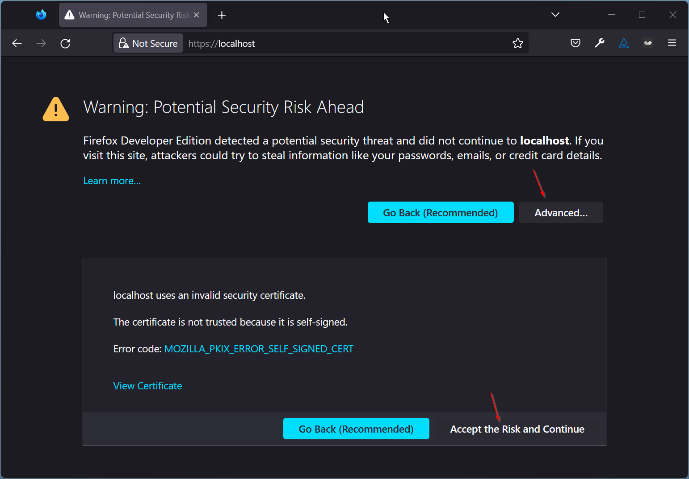

Photo
by [John Salvino](https://unsplash.com/@jsalvino?utm_source=unsplash&utm_medium=referral&utm_content=creditCopyText)
on [Unsplash](https://unsplash.com/s/photos/security?utm_source=unsplash&utm_medium=referral&utm_content=creditCopyText)


This is part 4 on how to set up and install Laragon.

When developing projects, the development environment should be as close as possible to the production one. We are
already at a disadvantage developing on Windows when normally, our production environment is Linux. We can not do
anything about this, we have a Windows computer! We can and should enable security.


## Certificates

Laragon makes security certificates for local development a doddle, this is a two-step process.

### Enable SSL

Select the Laragon **Preferences cog** in the top right

Enable SSL by clicking the **Enabled** checkbox in line with Apache SSL.

Close the Preferences by clicking the **X**

## Add the certificate to the trusted store

From the Laragon menu, click the **Menu**, choose **Apache**, choose **SSL**,
select **Add laragon.crt to Trusted Store**

Elevated user access control is required.

## Launch Web

Next click the **Web** button, which will launch the Laragon <https://localhost> site. If all has gone well it will have
a padlock 🔒.

## Troubleshooting

### Accept the Risk

Some browsers have extra security for self-signed certificates. There is normally a way to accept, for example with
Firefox, choose **Advanced...** and then **Accept the Risk and Continue**

For other browsers Google "\<browser name\> how do I allow self-signed certificates on localhost", there are many
fixes.
