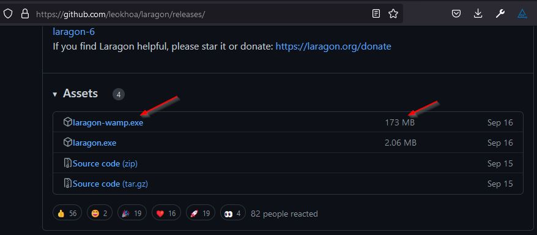
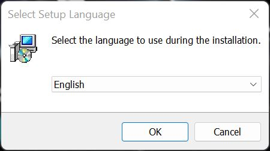
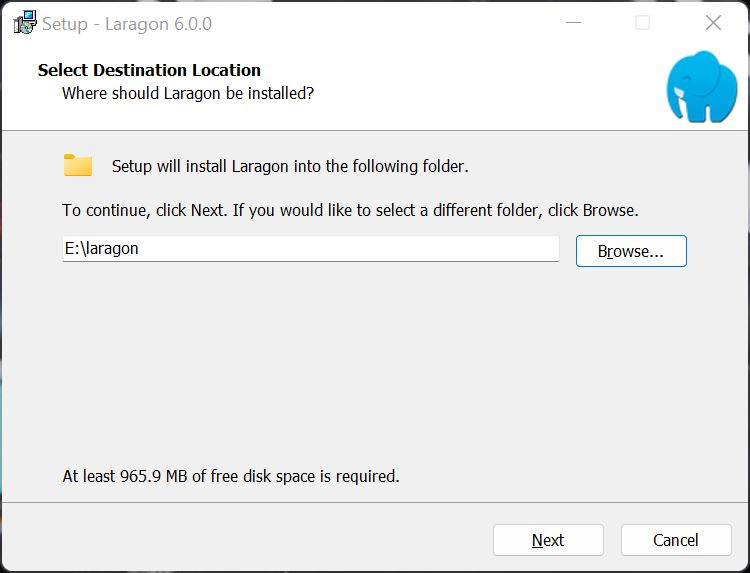
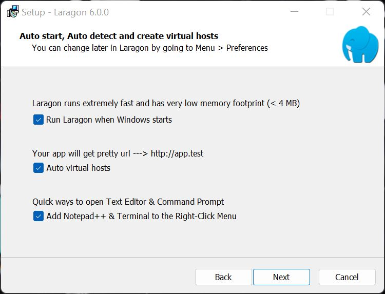
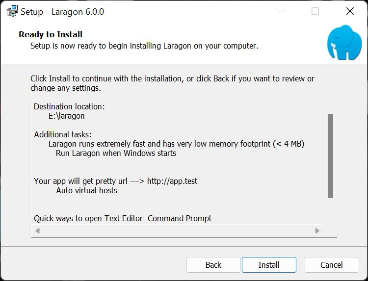
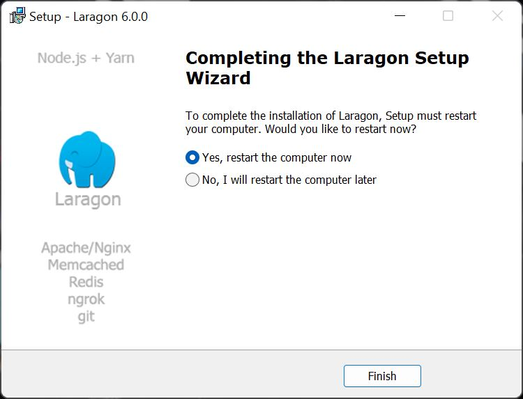

Photo
by [Nikolay Dukov](https://unsplash.com/@forbiddenbg?utm_source=unsplash&utm_medium=referral&utm_content=creditCopyText)
on [Unsplash](https://unsplash.com/s/photos/fountain?utm_source=unsplash&utm_medium=referral&utm_content=creditCopyText)


Laragon is my developer environment of choice on Windows, this is how I set up Laragon on a new computer.


## Why Laragon?

I don't know exactly when I started using [Laragon](https://laragon.org), probably in 2018 or 2019, I had tried XAMPP and WAMP.
When I tried Laragon I never looked back. The speed of Laragon, the ability to switch PHP versions and auto-generated
pretty URLs are the key reasons.

When I create a new project Laragon automatically updates the Windows hosts with a pretty URL, and configures an Apache
.conf file and/or NGINX .conf file. The project can be viewed with its pretty URL which is automatically created from
the project's folder name.

To open any project website I can select Laragon, and click start. Laragon will start Apache (by default) and MySQL.
Then Laragon menu > www > select the project folder name. Laragon will launch my default browser and open the pretty URL
of the project. It's fast and the Laragon magic just works, allowing me to get on with my work!

If you need more reasons see [Why Lagaon](https://laragon.org/why-laragon/) on Largon's website. there are links to
check out the Testimonials, to see how other users think of Laragon and it’s features page for more details.

## What's in the box?

Laragon 6.0.0 ships with:

- PHP 8.1.10
- MySQL 8.0.30
- Apache 2.4.54
- NGINX 1.22.0
- Nodejs 18.8.0
- NPM 8.18.0
- Cmder 210912
- Composer 2.4.1
- Cronical
- Git 2.37.3
- HeidiSQL 12.1.0.6537
- Memcached 1.6.8
- Ngrok 3.1.0
- Notepad++ 7.4.2
- Python 3.10.6
- Redis 5.0.14.1
- Sendmail
- Telnet 2.1b2

Laragon can [quickly add](https://laragon.org/docs/quick-add.html) other programming languages, such as Golang and Java.

Laragon can also [quickly create](https://laragon.org/docs/quick-app.html) new projects such as Laravel.

## Install Laragon

### Download the full version

The installation of Laragon is as simple
as [downloading the latest version](https://github.com/leokhoa/laragon/releases/)

Select the full version, which is 173 MB.

### Install Laragon

Once downloaded start the installation process by double-clicking **laragon-wamp.exe** in your downloads folder

### Choose your installation language

Choose your installation language, English is the default, and click **OK**.

### Select Destination Location

Select Destination Location. I have chosen **E:\laragon**, the default of **C:\laragon** is normally fine, click
**Next**.

### Select default options

Auto start, Auto detect and create virtual hosts.

- **Run Laragon when Windows starts** - if you're developing every day then select this otherwise deselect. You can
  manually start Laragon as required
- **Auto virtual hosts** - Laragon will automatically create a virtual host every time you create a new project in www,
  this is a good thing!
- **Add Notepad++ & Terminal to the Right-Click Menu** - Handy to right-click a file and open with Notepad++ for a quick
  peek. The terminal is Cmder, which will be installed by Laragon.

Select the required options and click **Next**

### Ready to Install

Ready to Install. Click **Install**

### Reboot to complete

Completing the Laragon Setup Wizard

Laragon will normally install Visual Studio C++ run time libraries, the computer will normally need a restart to
complete the process.

Click **Finish**

