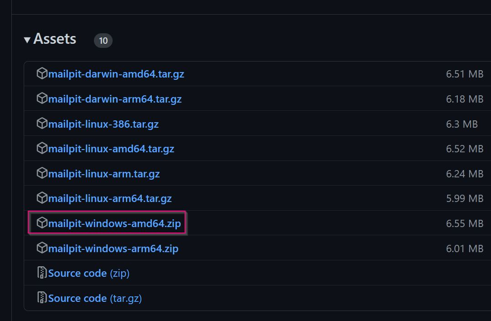
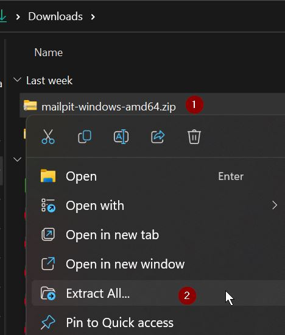
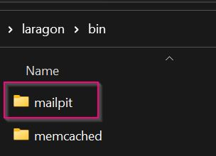
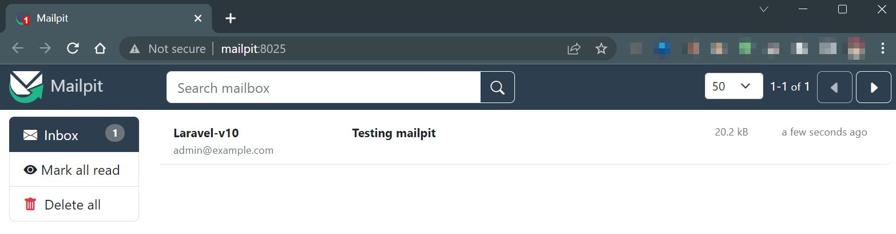
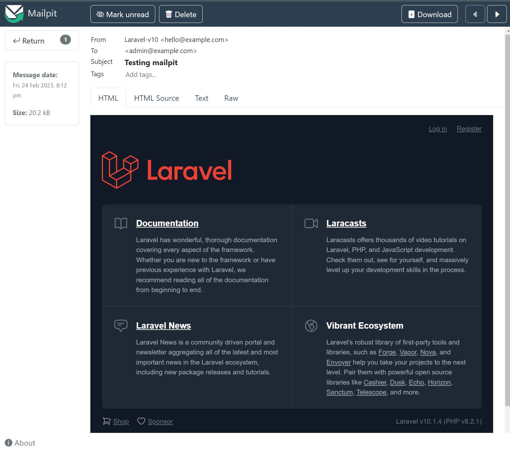
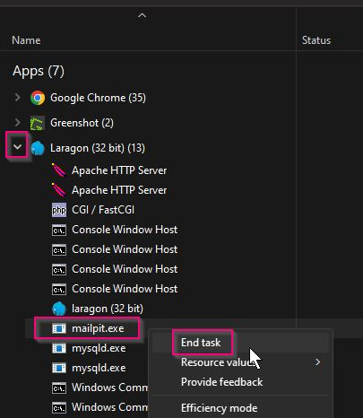
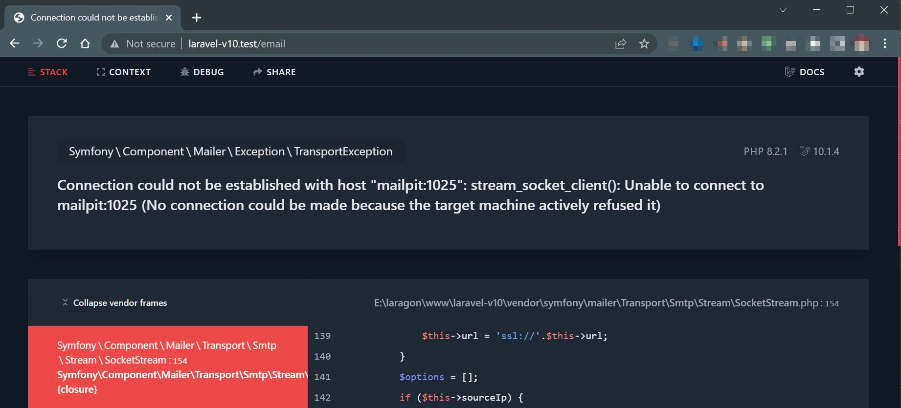
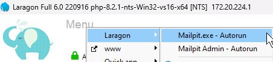
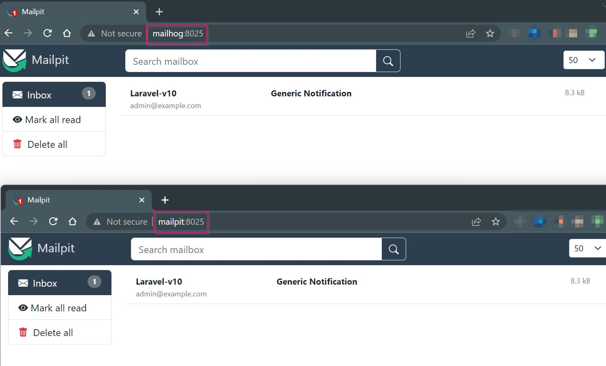

Photo
by [Image author](https://unsplash.com/@<Image-author>?utm_source=unsplash&utm_medium=referral&utm_content=creditCopyText)
on [Unsplash](https://unsplash.com/s/photos/security?utm_source=unsplash&utm_medium=referral&utm_content=creditCopyText)


Laragon ships with Mail Catcher, which intercepts mail sent using the PHP mail() function. Mailpit goes one step further
and acts as a local mailbox. No mail will ever leave the local PC!



Laravel 10's `.env.example` will use **Mailpit** as the default local mail provider. Mailpit is inspired by MailHog, it
has the same API. The author of Mailpit has completely rewritten Mailpit to be faster and better supported. Mailpit is
available as a free download from GitHub.


> Mailpit is a multi-platform email testing tool for developers.
>
> It acts as both an SMTP server and provides a web interface to view all captured emails.
>
> Mailpit is inspired by MailHog, but much, much faster.

## Download Mailpit

Mailpit can be downloaded from [GitHub mailpit releases](https://github.com/axllent/mailpit/releases/latest), the file
for Windows is **mailpit-windows-amd64.zip**.



## Extract the zip

Once the file has been downloaded the **zip** file will need to be extracted. Open your **download** folder:

1. right-click the **mailpit-windows-amd64.zip** file
2. select **Extract All...**



- when the extract wizard opens click the **extract** button
- return to the download folder and **copy** the **mailpit-windows-amd64** directory.

## Copy to Laragon

Navigate to your laragon > bin folder.

**Paste** the downloaded directory and rename it **mailpit**.



## Hosts file

Click the red **h** in the top right corner of Laragon, you will need to allow elevated privileges. By default,
the C:\WINDOWS\system32\drivers\etc\\**hosts** file will open in **Notepad++**.

Add the following lines above any Laragon magic:

```ini
# Manual
127.0.0.1    mailpit     # Manual for laragon\bin\mailpit\mailpit.exe

# Laragon magic
```

Save the file, you may need to allow elevated privileges again.

## Autostart

Open Laragon's Procfile (**Laragon menu > Laragon > Procfile**) and add these lines:

```ini
Mailpit.exe : autorun mailpit.exe PWD=C:\laragon\bin\mailpit
Mailpit Admin : autorun http://mailpit:8025
```

Every time Laragon starts the **mailpit.exe** will automatically run, in the background, and the mailpit admin website
will launch.

## Project settings

Projects will need to be configured to use the following settings:

- mail protocol: smtp
- hostname: mailpit
- port: 1025

Example Laravel app:

```ini
MAIL_MAILER = smtp
MAIL_HOST = mailpit
MAIL_PORT = 1025
MAIL_USERNAME = null
MAIL_PASSWORD = null
```

The above settings are the **default** for a Laravel 10+ app! No further changes are required 🎉.

## Testing

Start Laragon (or stop and start), the Mailpit admin page should open in your default browser.

To test it's working, in any Laravel project, open a **tinker** console `php artisan tinker`. Send the welcome view by
email:

```php
Mail::send('welcome', [], fn($message) => 
$message->to('admin@example.com')->subject('Testing mailpit'));
```

You should see `= Illuminate\Mail\SentMessage {#4721}`, the number will be different.

View the Mailpit admin page in your browser:



Click the **Testing mailpit** line to open it.



## mail() settings

Apps that use the PHP mail() function can be configured by editing the **php.ini**:

**Laragon menu > PHP > php.ini**, by default it will open in **Notepad++**.

Search (**CTRL** **F**) for the **mail function** and amend as follows:

```ini
[mail function]
; For Win32 only.
; https://php.net/smtp
SMTP = mailpit
; https://php.net/smtp-port
smtp_port = 1025

; For Win32 only.
; https://php.net/sendmail-from
sendmail_from = laragon@example.com

; For Unix only.  You may supply arguments as well (default: "sendmail -t -i").
; https://php.net/sendmail-path
;sendmail_path =

; Force the addition of the specified parameters to be passed as extra parameters
; to the sendmail binary. These parameters will always replace the value of
; the 5th parameter to mail().
;mail.force_extra_parameters =

; Add X-PHP-Originating-Script: that will include uid of the script followed by the filename
mail.add_x_header = Off

sendmail_path = "C:/laragon/bin/mailpit/mailpit.exe sendmail"
```

### Test mail()

Open the terminal (cmdr) and enter the PHP interactive shell:

```shell
php -a 
```

In the PHP interactive shell type (or paste) the following:

```php
mail('my_mail@example.com','Test', 'Test message', 'From: Laragon');
```

Open the Mailpit browser (<http://mailpit:8025>) to view the message:

")

## How to stop Mailpit

Laragon will start Mailpit using the Procfile, however, it will not close the running service when Laragon is exited.

### Command line

One of the easiest ways is from the command line:

From the command line, the **mailpit.exe** can be verified if it's still running:

```shell
tasklist | findstr /i /c:"mailpit.exe"
```

The output will be similar to:

```text
mailpit.exe     5248 Console       1     22,672 K
```

To kill the process:

```shell
taskkill /im mailpit.exe /f
```

Which will output similar to:

```text
SUCCESS: The process "mailpit.exe" with PID 5248 has been terminated.
```

This is dependent on the process being started as an administrator, or your account, elevated privileges may be required
to stop it.

### Task manager

To end the **mailpit.exe** process using **Task Manager**:

1. open Task Manager (<kbd>Win</kbd> start typing **Task** and press <kbd>Enter</kbd> when Task Manager displays as the
   first item)
2. sort by process **name** by clicking the **name** heading, the cravat **^** should display
3. **expand all** (under **view** dropdown)
4. look down the list for Laragon (even if Laragon is closed, it will be shown under background processes)
5. right-click **mailpit.exe**
6. select **End task**



Personally, Mailpit takes up 0.1% of memory and very little process, so I just leave it running, even after I close
Laragon.

## Troubleshooting

> Symfony\Component\Mailer\Exception\TransportException
>
> Connection could not be established with host "mailpit:1025":
> stream_socket_client(): Unable to connect to mailpit:1025 (No connection could be made because the target machine
> actively refused it).



If the **mailpit.exe** is not running Laravel will display the above error. Start mailpit, either by double-clicking the
**mailpit.exe** or **Laragon > Mailpit.exe**.



If Laragon isn't being used, check the local development environment.

Laravel 9 would use **Mailhog**, in Laravel 10 this has been changed to **mailpit**.

**.env** for Laravel 9:

```ini
MAIL_MAILER = smtp
MAIL_HOST = mailhog
MAIL_PORT = 1025
```

**.env** for Laravel 10:

```ini
MAIL_MAILER = smtp
MAIL_HOST = mailpit
MAIL_PORT = 1025
```

### Mailpit or MailHog

Mailpit and MailHog can not run at the same time, as they both use the same port and API:

- smtp: port 1025
- website: port 8025

This does mean they can be used interchangeably, or one can impersonate the other 🎉.

#### Alternative hosts file

Amend the **hosts** file to have **both** mailpit and mailhog:

```text
# Manual
127.0.0.1   mailpit		# Manual set see C:\laragon\bin\mailpit or mailhog
127.0.0.1   mailhog		# Manual set see C:\laragon\bin\mailpit or mailhog
```

It doesn't matter if **mailpit.exe** or **mailhog.exe** is running, either will respond to the email request the same
way.

When running Laravel 9 projects will send emails to mailhog:1025. Laravel 10 projects will send emails to
mailpit:1025. As long as **either** Mailpit or MailHog are running the email will be handled by either 👍.

The admin website can also be opened to <http://mailpit:8025> or <http://mailhog:8025>, whichever mail client is running
will be displayed, as they both will respond on port 8025.



Laravel is only sending **smtp** requests to **mailpit:1025** or **mailhog:1025**, as long as Laravel can send the email
over smtp it doesn't care if the smtp client is Mailpit or MailHog 🎉.

## Further information

Mailpit has many additional features, such as **Email storage**, **HTTPS** and many more. For details see
the [Mailpit Wiki](https://github.com/axllent/mailpit/wiki).
