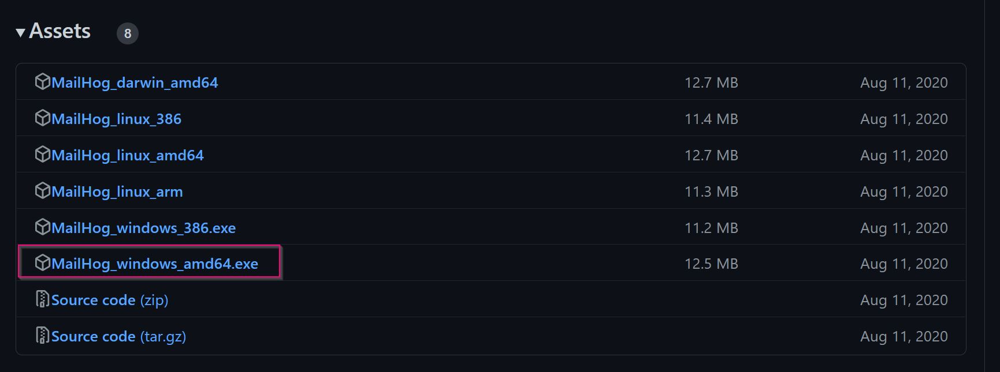
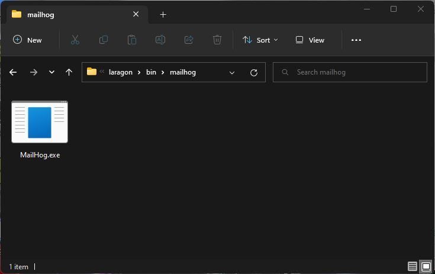
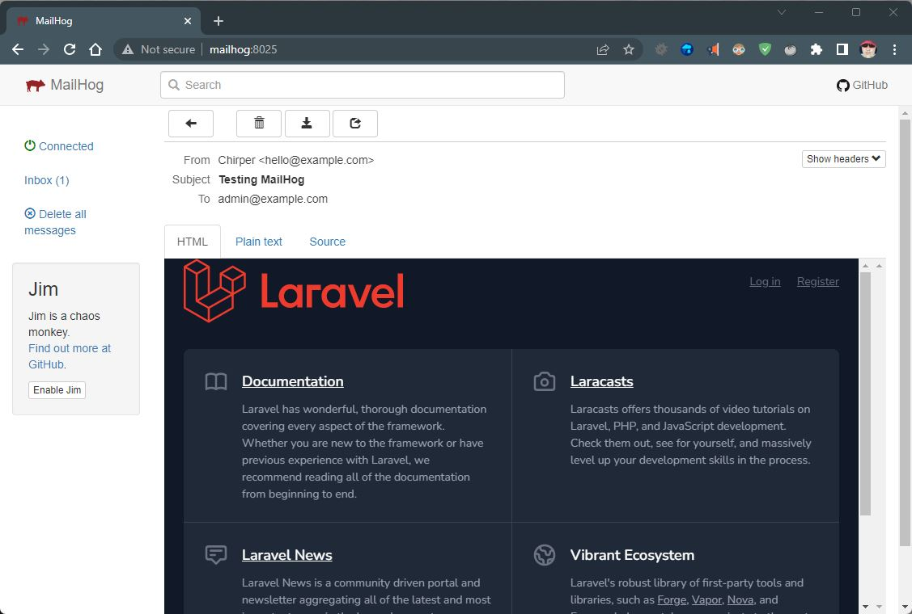

Photo
by [Kutan Ural](https://unsplash.com/@kutanural?utm_source=unsplash&utm_medium=referral&utm_content=creditCopyText)
on [Unsplash](https://unsplash.com/photos/yCxBGq7nuA8?utm_source=unsplash&utm_medium=referral&utm_content=creditCopyText)


Laragon ships with Mail Catcher, which intercepts mail sent using the PHP mail() function. MailHog goes one step further
and acts as a local mailbox. No mail will ever leave the local PC!


## Download MailHog

Download MailHog from [releases](https://github.com/mailhog/MailHog/releases), the file for Windows
is **MailHog_windows_amd64.exe**



## Copy to Laragon

Create a directory in the laragon bin folder called **mailhog**

Copy the downloaded file and rename it **MailHog.exe**



## Hosts file

Click the red **h** in the top right corner of Laragon, you will need to allow elevated privileges. By default,
the C:\WINDOWS\system32\drivers\etc\\**hosts** file will open in **notepad++**

Add the following lines above any Laragon magic:

```ini
# Manual
127.0.0.1      mailhog	    # Manual for laragon\bin\MailHog.exe

# Laragon magic
```

Save the file, you may need to allow elevated privileges again.

## Autostart

Open Laragon's procfile (**Laragon menu > Laragon > Procfile**) and add these lines:

```ini
MailHog.exe : autorun MailHog.exe PWD=C:\laragon\bin\mailhog
MailHog Admin : autorun http://mailhog:8025 
```

Every time Laragon starts the MailHog.exe will automatically run, in the background, and the MailHog admin website will
launch.

## App settings

Any apps you create will need to be configured to use the following settings:

- mail protocol: smtp
- hostname: mailhog
- port: 1025

Example Laravel app:

```ini
MAIL_MAILER = smtp
MAIL_HOST = mailhog
MAIL_PORT = 1025
MAIL_USERNAME = null
MAIL_PASSWORD = null
```

The above settings are the **default** for a Laravel app! No further changes are required 🎉

## Testing

Start Laragon (or stop and start), the MailHog admin page should open in your default bowser.

To test it's working, in any Laravel project, open a **tinker** console `php artisan tinker`. Send the welcome view by
email:

```php
Mail::send('welcome', [], fn($message) => 
$message->to('admin@example.com')->subject('Testing MailHog'));
```

You should see `= Illuminate\Mail\SentMessage {#4721}`

View the MailHog admin page in your bowser, click the inbox and the message to open it:



## Further information

Mailhog has a **Chaos Monkey**, inspired by Netflix. Which can randomly add faults. This can be used to test how your
app responds to mail failures: [Introduction to Jim](https://github.com/mailhog/MailHog/blob/master/docs/JIM.md)

[Authentication](https://github.com/mailhog/MailHog/blob/master/docs/Auth.md) can be set up, as required.
