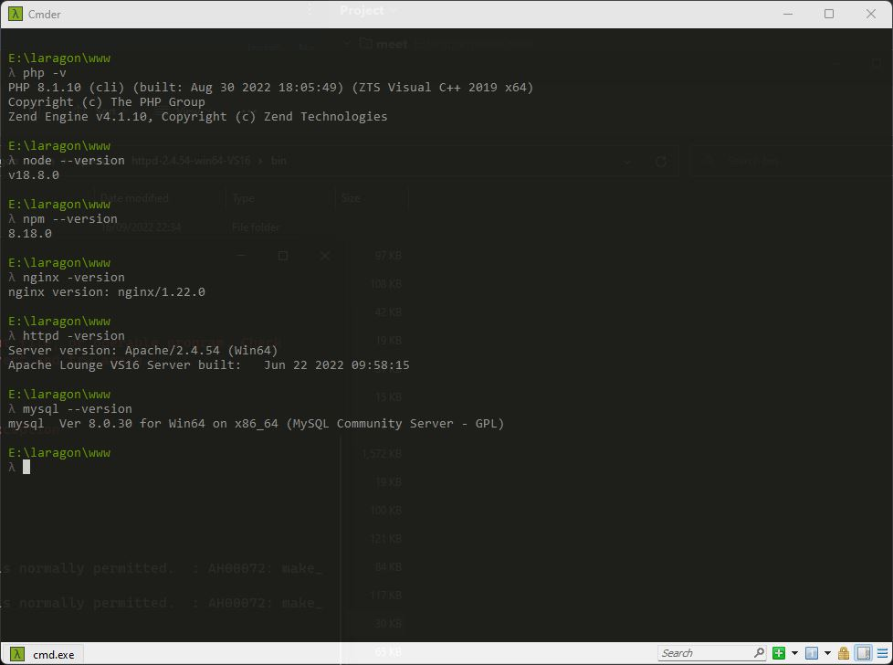
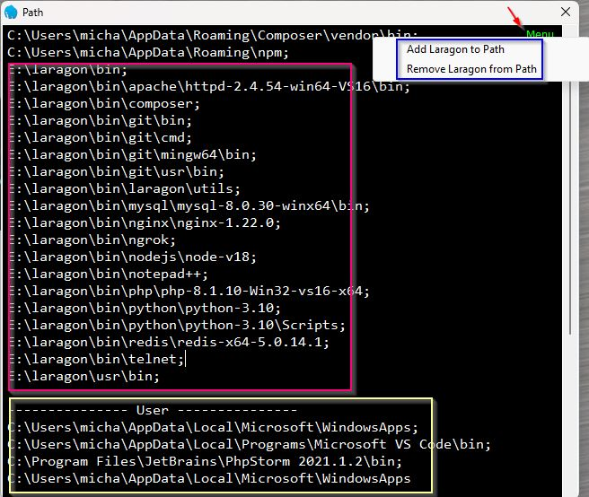
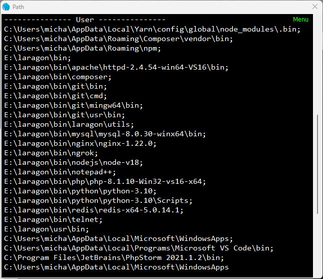
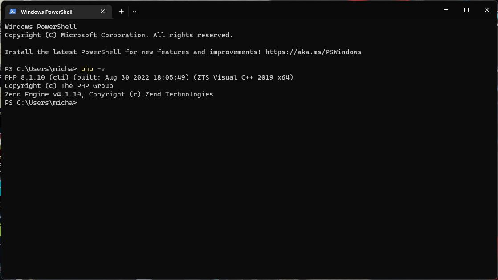

Photo
by [Grooveland Designs](https://unsplash.com/@groovelanddesigns?utm_source=unsplash&utm_medium=referral&utm_content=creditCopyText)
on [Unsplash](https://unsplash.com/photos/apekIDd6sT0?utm_source=unsplash&utm_medium=referral&utm_content=creditCopyText)


Laragon's terminal is **cmder**, which will automatically give command line access to all tools in Laragon's development
environment. If other terminals are required then Laragon can add the development tools to the Windows User environment
PATH.


## Cmder

Laragon's terminal **cmder** can be opened from **Laragon menu > Laragon > Terminal** or click the **Terminal** button.

Out-of-the-box **Cmder** automatically has access to many of the development environment tools. However, if you try
accessing them using **CMD**, **Powershell** or the terminal building into your favourite IDE they will not be
available.

## Add to PATH

The solution provided by Laragon is to add Laragon to PATH. Rather than do this directly from the menu I prefer to check
the current status using **Manage path**.

### Manage path

To view the current Laragon path and your user path select **Laragon Menu > Tools > Path > Manage Path**

You can see Laragon's paths in the red rectangle. The yellow rectangle highlights the current user paths, which don't
include any of Laragon's development tools. The blue rectangle is what we need next.

### Add Laragon to the user path

To add Laragon's paths to your user path, and make them available in all terminals: Click **Menu** (in the top right
corner), then select **Add Laragon to Path**.

Scroll down, you will see the Laragon path has been copied to the user section.

Open a terminal and type `php -v` you should now see PHP has been added.

Example PowerShell:

{}
If you have a message like 'php: The term 'php' is not recognized ...', you will need to **Sign out** and **Log in**
for the user path to take effect.
{}

