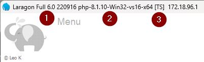
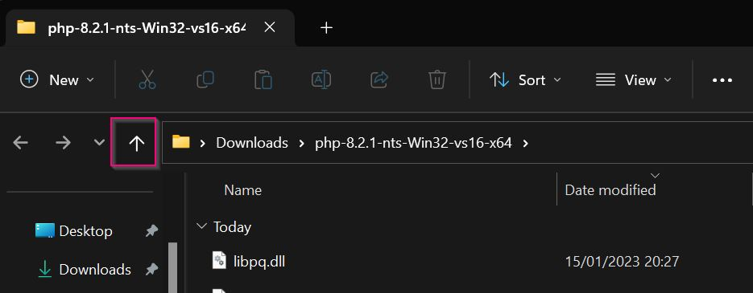
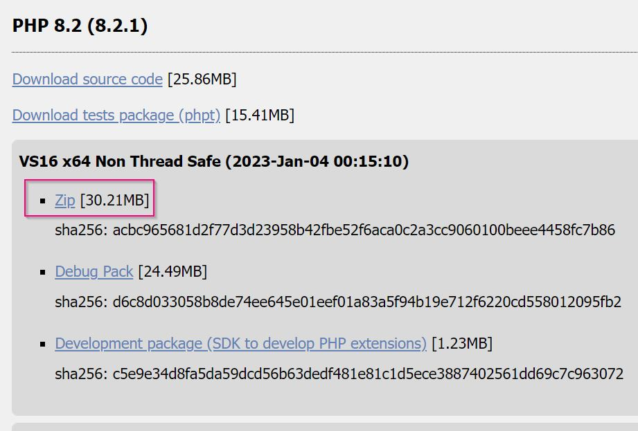
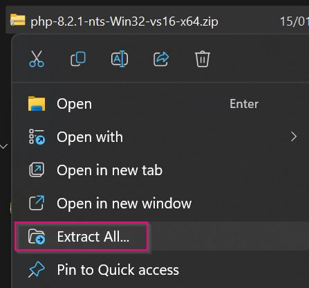
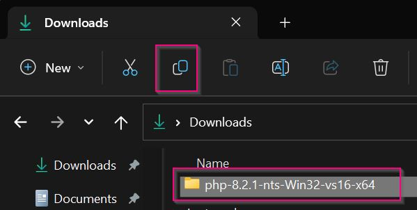
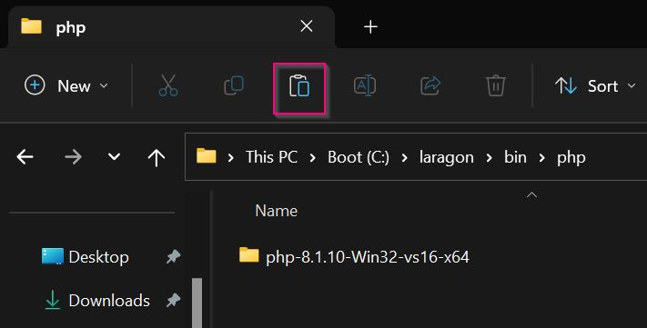
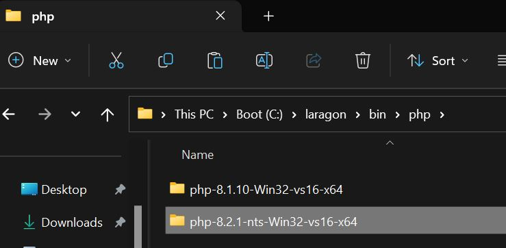
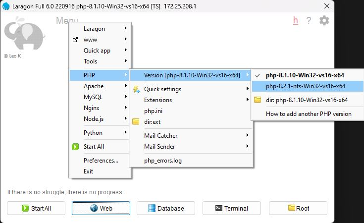
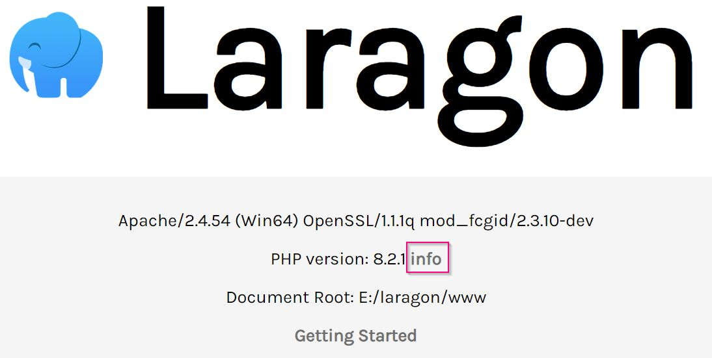
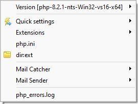

Generated by [DALL-E](https://labs.openai.com/)


Updating the version of PHP is probably the most common change I make in Laragon, the ability to switch from PHP 7.4 to 
PHP 8.2 in a few clicks Laragon's magic.


## Selecting the correct version

There are three criteria to take into account before the correct version of PHP can be downloaded:

1. Visual Studio C++ run time - PHP source code is compiled using Microsoft Visual Studio, the current version of Visual
   Studio 2019 compiles to **VC16**
2. Architecture - Laragon Full version is **64-bit**, the portable version is **32-bit**
3. Thread safety
    - Apache with mod_php requires a Thread Safe (TS) build
    - NGINX, IIS and Apache with mod_fastcgi requires a Non-Thread-Safe(NTS) build

|                       | 64-bit (x64 / AMD64) | 32-bit (x32 / x86)   |
|:----------------------|:---------------------|:---------------------|
| Thread Safe (TS)      | Apache (mod_php)     | Apache (mod_php)     |
| Non-Thread Safe (NTS) | Apache (mod_fastcgi) | Apache (mod_fastcgi) |
| Non-Thread Safe (NTS) | NGINX                | NGINX                |
| Non-Thread Safe (NTS) | IIS                  | IIS                  |

Further details can be found under
the [Manual PHP Installation on Windows](https://www.php.net/manual/en/install.windows.manual.php).

The version of PHP will therefore depend on how close to your production environment you want to get. If you are not
sure then download the NTS version, Laragon will switch Apache to use **mod_fastcgi**.

### Window source

The only place PHP zip files should be downloaded from is the official site:

- [Windows PHP.net download](https://windows.php.net/download/)

The site is confusing at first, so I will explain the correct files to download, based on which web server Laragon is
using and which architecture.

If I have Laragon 6.0.0 full version, which is 64-bit (x64), and I want to use **Apache** I can use the Thread
Safe (**TS**) version or the x64 Non-Thread Safe (**NTS**) version. If I want to use **NGINX** I need the x64
Non-Thread Safe (**NTS**) version.

Generally, 32-bit architecture is not used much now. Although the portable version of Laragon does ship with some
32-bit!

- 32-bit architecture can be called x86, which is a reference to intel chips, 8086, 286, 386 and 486
- 64-bit architecture is normally referred to as x64, or WIN64, or sometimes AMD64, as AMD was the first to market
  64-bit chips

Most modern computers, regardless of the AMD or Intel processors are 64-bit now.

The easiest way to see which version is required by Laragon, is to open Laragon and look at the title bar.

### Example PHP 8.1 TS



1. Laravel full version 6.0
2. PHP 8.1.10 Win32 vs16 x64 - PHP 8.1 release 10. Visual Studio 2019. 64 bit
3. [TS] - Thread safe - can be used with Apache (mod_php)

This is the default version supplied with Laragon 6.0 full.

### Example PHP 8.1 NTS



1. Laragon full version 6.0
2. PHP 8.1.12 nts Win32 vs16 x64 - PHP 8.1 release 12. NTS. Visual Studio 2019. 64 bit
3. [NTS] - Non-Thread Safe (NTS) - can be used with Apache (mod_fastcgi) or NGINX

## Download 8.2

In this walkthrough we will:

- download the latest version of PHP 8.2 64-bit NTS
- extract
- copy to the Laragon PHP folder
- switch versions in Laragon
- verify its working

### Download from PHP.net

The only recommended place to download PHP is from [windows PHP.net download](https://windows.php.net/download/)

At the time of writing the latest release of PHP 8.2 is (8.2.1), feel free to download the latest release of PHP 8.2.



Click the **Zip** link. We are not interested in the source code, tests package, debug pack or development package.

### Extract

Once your browser has downloaded the **zip** open the Download location. In Chrome the **^** next to the filename
has **Show in folder**.

In Windows Explorer, right-click the downloaded file and select **Extract all..**



Leave all the locations as default and click the **Extract** button to start.

Wait for the file to be extracted and Windows Explorer will open the folder.


Click the **up arrow** to return to the **downloads** folder.



Make sure the **folder** (not the zip file) is selected and click the **copy** icon.

### Copy to the PHP folder

- Navigate to the laragon folder > bin > php

The easiest way to navigate to the Laragon area of your computer is to click the **Root** button in the bottom right
corner of Laragon. Laragon will open Windows Explorer in the laragon > **www** directory.



- Click the **up arrow** to navigate to the **laragon** directory.
- Double click **bin**
- Double click **php**
- Click the **paste** icon.

The folder from **downloads** will copy.



### Switch versions in Laragon

Laragon will instantly add the new PHP version to the PHP menu!

To switch versions navigate **Laragon menu > PHP > php 8.2.1-nts-Win32-vs16-x64**



The new version will be selected and configured. If Apache or Nginx are running they will automatically be **Reloaded**.
If you see any errors see **Troubleshooting** below.

Laragon will automatically set up the **php.ini**:

- enable common extensions
- set a generous max run time and file uploads
- configure **error_log** to the temp laragon directory.
- add pear include path to laragon etc php **pear** directory (commmon)
- configure curl cainfo to use the laragon ssl **cacert.pem** certificate, which will allow secure downloads.

### Verify its working

To verify its working, if Apache hasn't been started click **Start all**.

Click Laragon's **Web** button.



Click the **info** link next to the PHP version 8.2.1 and output from `phpinfo()` will display.

## Additional config

I don't upgrade PHP every release, as long as my local environment is close to production, I have no problems developing
locally using Laragon.

Each time I update I will also, manually, add the following:

- Xdebug
- opcache
- mailhog

### Xdebug

For the full version of how to install Xdebug see my
blog [How to Set up VS Code to use PHP with Xdebug 3 on Windows](https://pen-y-fan.github.io/2021/08/03/How-to-Set-up-VS-Code-to-use-PHP-with-Xdebug-3-on-Windows/)
to summarise the blog:

- download the correct version from [Xdebug downloads](https://xdebug.org/download)
- copy the downloaded **php_xdebug-3.2.0-8.2-vs16-nts-x86_64.dll** (version at the time of writing, later versions can
  be downloaded)
- to **C:\laragon\bin\php\php-8.2.1-nts-Win32-vs16-x64\ext** (**Laragon menu > PHP > dir:ext**)
- edit the **php.ini** (**Laragon menu > PHP > php.ini**)

```ini
[xdebug]
zend_extension = xdebug-3.2.0-8.2-vs16-nts-x86_64
xdebug.mode = coverage,debug,develop
```

### Opcache

Add the following settings to **php.ini** (**Laragon menu > PHP > php.ini**).

```ini
[opcache]
opcache.enable = On
opcache.enable_cli = On
```

Enable the **opcache** extension (**Laragon menu > PHP > Extensions > opcache**).

### Mailhog

For the full version
see [How to set up Laragon on a new Windows computer (part 5) - MailHog](https://pen-y-fan.github.io/2023/01/04/how-to-set-up-laragon-on-a-new-windows-computer-part-5/)

In summary one MailHog is set up amend the mail options in **php.ini**:

```ini
[mail function]
; For Win32 only.
; https://php.net/smtp
SMTP = mailhog
; https://php.net/smtp-port
smtp_port = 1025

; For Win32 only.
; https://php.net/sendmail-from
sendmail_from = laragon@example.com

; For Unix only.  You may supply arguments as well (default: "sendmail -t -i").
; https://php.net/sendmail-path
;sendmail_path =

; Force the addition of the specified parameters to be passed as extra parameters
; to the sendmail binary. These parameters will always replace the value of
; the 5th parameter to mail().
;mail.force_extra_parameters =

; Add X-PHP-Originating-Script: that will include uid of the script followed by the filename
mail.add_x_header = Off

sendmail_path = "C:/laragon/bin/mailhog/MailHog.exe sendmail"
```

### Others

The above are examples on how I set up PHP. You are free to edit the **php.ini** as required for your specific set up.

## The PHP menu



Laragon's PHP menu has many options and helper functions.

### Version

In this screenshot PHP 8.2.1 is selected. Expand the menu and another PHP version can be selected.

### Quick settings

- **Xdebug** can be toggled on and off (if downloaded)
- **max_execution_time** is set to a very generous 36,000 seconds (600 minutes)!
- **upload_max_filesize** is set to 2 Gigabytes
- **post_max_filesize** is set to 2 Gigabytes
- **memory_limit** is set to 512 Megabytes

Selecting any of the items will allow new values to be set.

If you have an error like:

> PHP Fatal error:  Allowed memory size of 536870912 bytes exhausted (tried to allocate 20480 bytes) in ...

The **memory_limit** may need to be increased.

### Extensions

Enable and disable the required extensions. For example: In Laravel to run 'in memory' tests the **pdo_sqlite**
extension
is required.

When an extension is enabled and disabled Laragon is uncommenting and commenting out the extension
in **php.ini**.

### php.ini

Notepad++ will open the php.ini for the selected php version.
(e.g. **C:\laragon\bin\php\php-8.2.1-nts-Win32-vs16-x64\php.ini**).

### dir:ext

Windows explorer will open in the **ext** directory of the selected PHP version
(e.g. **C:\laragon\bin\php\php-8.2.1-nts-Win32-vs16-x64\ext**).

### Mail Catcher

For more information view [laragon > doc > mail catcher](https://laragon.org/docs/mail-catcher.html)

> When mail() function is called, Laragon will display generated email info in a small Window on the bottom right of
> your screen. Therefore, you can preview your emails quickly, easily and be sure that your mail() function works.

> Emails are saved as html or text files and located in C:\laragon\bin\sendmail\output

### Mail Sender

For more information view [Laragon > docs > mail catcher](https://laragon.org/docs/mail-sender.html)

> Mail Sender helps you use PHP mail() function to send mail to Internet easily and effortlessly with no worry about
> being marked as Spam or complex SMTP server configurations.

### php_errors.log

Notepad++ will open the **E:\laragon\tmp\php_errors.log**.

{}
This log is the same for all the PHP versions.
{}

## Troubleshooting

### PHP Startup: Unable to load dynamic library

Sometimes Laragon's magic has a hiccup, particularly when changing versions PHP 7 to/from PHP 8 when Apache is running.
There will be an error displayed (sometimes up to 10!):

PHP Warning:  PHP Startup: Unable to load dynamic library 'curl'
(tried: C:/laragon/bin/php/php-8.0.19-Win32-vs16-x64/ext\curl (The specified module could not be found)

The only thing to do is keep clicking Ok, then **Stop** and **Start All**.

The workaround is to **Stop**, switch versions and then **Start all**.

### Automatic reload

When switching versions Laragon runs the automatic **Reload** for Apache and Nginx. Sometimes this doesn't pick up the
latest settings. The workaround is to **Stop** and **Start All**. Then click **Web** and **info** to view
the **phpinfo()** output. Verify the correct version of PHP is loaded with the required extensions.

## Conclusion

I hope this blog will help to see how Laragon's local development is easier. The automatic pretty URLs and the ability
to easily switch PHP versions are the things that help me the most. Laragon sets up the project for me and then gets out
of the way. I can get on with development. No fiddling with **.conf** and **hosts** files, it does it all for me. 🎉

Switching versions of Apache is very similar, don't be afraid to check out the other menus. The
official [Laragon documentation](https://laragon.org/docs/) has more details on each of the features.

I hope you enjoy your development time using Laragon.
